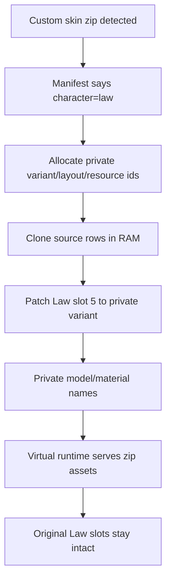

# OPPW4 Patcher - Current Handoff

Last updated: 2026-05-15 after patching the LinkData static costume table.

## LinkData Static Slot Publication Rollback - 2026-05-15 18:55

User test of the static entry3 patch showed a global side effect: Chopper moved
from the Straw Hat crew tab into the Pirates tab, while Law still had only four
slots. That means entry3 is not safe to clone/edit as a simple Law slot list.
It likely participates in broader character/category presentation, and the
row/active-count fields overlap or affect global tab classification.

Immediate rollback installed:

```text
restored D:\SteamLibrary\steamapps\common\OPPW4\mods\_oppw4\linkdata_override\LINKDATA_A.BIN
from D:\SteamLibrary\steamapps\common\OPPW4\mods\_oppw4\linkdata_override\LINKDATA_A.before-static-slot699.20260515-185043.BIN
SHA-256 9DEC82F1D119B2C943C12BEC3BAF894636B94BC4336BECDAC084169271FB3DAF
```

Code cleanup:

- entry3/static slot patch is no longer applied by default;
- it is now gated behind explicit `--patch-static-slot-table`;
- do not use that flag for normal override generation until the entry3 row
  semantics are understood.

Next safer direction:

- keep the LinkData-only DLL and the safe override with entry29/32/35/39/52/58;
- do not mutate entry3 as a full row clone;
- find the actual runtime menu row/count source that produces
  `Costume object update count=4` for Law;
- if entry3 is revisited, patch only one field at a time on a throwaway build,
  never clone `0x4b` bytes from row `131 -> 699`.

## Law Slot Source Read-Only Probe - 2026-05-15 19:04

Installed a read-only diagnostic DLL to compare the safe LinkData override with
the RAM tables the game actually consumes. No LinkData override mutation was
made in this step.

New expected lines:

```text
law-linkdata-slot-source ...
law-ram-slot-source ...
law-slot-count-source-diff ...
Law menu row slot probe ...
```

The probe logs:

- LinkData override entry3 layout `26`, variant `699` metadata, and whether
  entry29/39/52/58 contain the custom costume/layout records;
- RAM `static_layouts` layout `26` variants and active count;
- RAM `static_rows` row `70` menu slot values;
- the runtime `Costume object update count` compared with layout/row slot
  values.

Installed:

```text
D:\SteamLibrary\steamapps\common\OPPW4\dinput8.dll
SHA-256 A3E47AEBA2F53E87895AA07C3C068E985E04EA4B3259F1611584362C2431AD6A
backup D:\SteamLibrary\steamapps\common\OPPW4\dinput8.before-law-slot-source-probe.20260515-190403.dll
```

Verification:

```text
cargo fmt --check: passed
cargo test -p oppw4-rdb-tool linkdata -- --nocapture: 30 passed
cargo test -p oppw4-rdb: 39 passed
cargo build --release -p oppw4-dinput8-proxy: passed
```

## LinkData Static Slot Publication - 2026-05-15 18:50

Run `2026-05-15_18-40-17.log` confirmed the LinkData-only DLL was active and
the override was loaded, but Law still had only four runtime costume entries:

```text
Law duplicate variant slot patch disabled by LinkData-only diagnostic build
Costume object update ... count=4 ...
entries=[57,58,555,586]
```

The missing natural slot was not entry29 alone. The static costume table in
LinkData entry `3` contains Law's published variant list:

```text
layout 26 variants: 57,58,555,586,ffff...
```

Implemented `apps/rdb-tool/src/linkdata_patch_apply.rs` support for entry `3`:

- clone static layout row `131 -> 699`;
- patch Law layout `26`, slot `4`, to variant `699`;
- patch Law active variant count to `5`;
- clone static variant metadata `586 -> 699`;
- set variant `699` model resource to `292`;
- set preview mapping to `294` (`mapped=911`);
- clear the DLC entitlement bit in the copied metadata flags.

Generated and installed:

```text
linkdata-reference-map/LINKDATA_A.clone-oni-to-292-699.static-slot.raw-expanded.BIN

D:\SteamLibrary\steamapps\common\OPPW4\mods\_oppw4\linkdata_override\LINKDATA_A.BIN
SHA-256 687FC6B2303439F5F5CA25E9840141AF3862F8252173EC66AABC4718FFF821C2
backup D:\SteamLibrary\steamapps\common\OPPW4\mods\_oppw4\linkdata_override\LINKDATA_A.before-static-slot699.20260515-185043.BIN
```

Verification:

```text
cargo fmt --check: passed
cargo test -p oppw4-rdb-tool linkdata -- --nocapture: 30 passed
cargo test -p oppw4-rdb: 39 passed
```

Next run should answer the important question:

- if Law now has `count=5` in the menu, entry3 was the missing natural slot
  publication table;
- if it still has `count=4`, the remaining slot count is probably from a
  second table loaded after entry3, and the next place to inspect is the
  runtime `static_rows`/menu row source rather than DLC/name/layout records.

## LinkData-Only Slot Diagnostic - 2026-05-15

After the Oni-source runtime metadata run, the preview image changed but the
model/costume still did not load. That means the runtime hook may still be
masking what the raw-expanded LinkData is capable of doing on its own.

Applied a clean diagnostic build:

- the config flag `duplicate_law_variant_slot` is now ignored intentionally;
- `DUPLICATE_LAW_VARIANT_SLOT_ENABLED` stays `false`;
- no runtime slot allocation;
- no metadata clone;
- no variant metadata clone;
- no model resource patch;
- no preview mapping patch;
- no runtime unlock slot clone;
- no duplicate-slot DLC alias path;
- LinkData override remains active.

Expected startup log:

```text
Law duplicate variant slot patch disabled by LinkData-only diagnostic build
```

There should be no lines like:

```text
Custom variant allocation table entries=1 ...
Law extra slot metadata clone ...
Law extra slot variant metadata clone ...
Law extra slot model resource patch ...
Law extra slot preview mapping patch ...
Law extra slot variant patch layout=26 slot=4 ...
```

Interpretation:

- if slot 5 still appears, the raw-expanded `LINKDATA_A.BIN` is publishing the
  slot naturally and we can delete most of the runtime slot hook path;
- if slot 5 disappears, LinkData still lacks one of the registry/slot-list
  records the game uses to expose the slot;
- if slot 5 appears but remains transparent, the slot exists naturally and the
  next issue is asset/model binding, not runtime slot creation.

Verification:

```text
cargo fmt --check: passed
cargo test -p oppw4-dinput8-proxy: 109 passed
cargo test -p oppw4-rdb: 39 passed
cargo build --release -p oppw4-dinput8-proxy: passed
```

Installed:

```text
D:\SteamLibrary\steamapps\common\OPPW4\dinput8.dll
SHA-256 149853D4559FE464D7FBBDA0D0A056E162BC984F043B6C01AAE21AA1BBC82CDD
backup D:\SteamLibrary\steamapps\common\OPPW4\dinput8.before-linkdata-only-slot.20260515-183143.dll
```

Follow-up after user confirmed slot 5 disappeared:

The LinkData dump already had `model_count=5` and `layout_count=5`, but Law's
DLC costume list still had only the two official DLC rows:

```text
DLC_COSTUME_005_555_026_002
DLC_COSTUME_006_586_026_003
```

Added entry29 patching to the LinkData generator. New override:

```text
linkdata-reference-map/LINKDATA_A.clone-oni-to-292-699.same-oni-assets.with-dlc.raw-expanded.BIN
```

The dump now shows:

```text
model_count=5
layout_count=5
dlc_count=3
DLC_COSTUME_007_699_026_004
```

Installed as:

```text
D:\SteamLibrary\steamapps\common\OPPW4\mods\_oppw4\linkdata_override\LINKDATA_A.BIN
SHA-256 9DEC82F1D119B2C943C12BEC3BAF894636B94BC4336BECDAC084169271FB3DAF
backup D:\SteamLibrary\steamapps\common\OPPW4\mods\_oppw4\linkdata_override\LINKDATA_A.before-dlc699.20260515-183929.BIN
```

The DLL remains the LinkData-only build, so the next run tests whether entry29
is the missing natural slot publication row.

## LinkData Runtime Metadata Cleanup - 2026-05-15 18:27

## LinkData Runtime Metadata Cleanup - 2026-05-15 18:27

Run `2026-05-15_18-21-58.log` confirmed the override and menu wiring were still
correct:

```text
LinkData override enabled ... size=0x4321670
slot=4 args=292/65535/0 variant=699 model=292 preview_mapping=294 preview_mapped=911
```

The model manager also loaded `292` as its own entry:

```text
target id=292 ... state=2
source id=26 ... state=2
alias_ptr_equals_source=false
```

But the preview remained transparent. The suspicious part was that the runtime
slot creation hook still built slot 5 from old hybrid metadata sources:

```text
metadata_layout=555 metadata_variant=555
color source=57
```

That could corrupt the new LinkData test because the installed override now
uses an Oni-style clone:

```text
row 292 name=MDLC069_Law_Oni
layout 699 cloned from Oni layout 131
variant path expected from Oni variant 586
```

Applied cleanup for the next run:

- runtime metadata source layout changed from `555` to Oni layout `131`;
- runtime metadata source variant changed from `555` to Oni variant `586`;
- runtime color variation source changed from `57` to Oni variant `586`;
- no controller restore, no `4713` mutation, no `1957` mutation, no force
  visible, no `child48`, no queue patch.

Expected next log:

```text
Custom variant allocation ... metadata_layout=131 metadata_variant=586
Law extra slot metadata clone source_layout=131 target_layout=699
Law extra slot variant metadata clone source_variant=586 target_variant=699
Law extra slot color variation patch source_variant=586 target_variant=699
slot=4 args=292/65535/0 variant=699 model=292 preview_mapping=294 preview_mapped=911
```

Interpretation:

- if slot 5 shows Oni, the previous runtime clone sources were corrupting the
  LinkData clone;
- if slot 5 remains transparent, hooks are probably no longer the main
  corruption source and the next branch should compare all LinkData records
  referenced by `308` vs `292`, especially records beyond entry35/39/58/52/32.

Verification:

```text
cargo fmt --check: passed
cargo test -p oppw4-dinput8-proxy: 109 passed
cargo test -p oppw4-rdb: 39 passed
cargo build --release -p oppw4-dinput8-proxy: passed
```

Installed:

```text
D:\SteamLibrary\steamapps\common\OPPW4\dinput8.dll
SHA-256 9D804BEE65C22F04730181EAA0F5B28E54B67E1CBCBEC6004F4013F15E6C234D
backup D:\SteamLibrary\steamapps\common\OPPW4\dinput8.before-oni-runtime-metadata.20260515-182727.dll
```

## LinkData Runtime Follow-Up - 2026-05-15 18:15

Run `2026-05-15_18-09-36.log` validated the raw-expanded override:

```text
LinkData override enabled ... size=0x4321670
Open virtual ... LINKDATA_A.BIN ... mod_size=0x4321670
```

Law now boots and shows 5 slots, but the runtime still selected the old
fallback values for slot 5:

```text
slot=4 variant=699 model=26 preview_mapping=26 preview_mapped=643
```

Cause: the old runtime safety path still treated missing RAM clone `292` as a
reason to patch variant `699` back to base Law model `26`. That was correct
before the raw-expanded LinkData existed, but it is now counterproductive.

Applied fix:

- `law_extra_slot_model_resource_for_patch(...)` now always returns `292`;
- preview mapping patch is enabled so variant `699` copies Oni's mapping
  `294 -> 911`;
- controller restore diagnostics remain disabled permanently after the crash;
- `mapped2d8=4713` and `1957` mutations remain disabled/read-only.

Expected next log:

```text
slot=4 variant=699 model=292 preview_mapping=294 preview_mapped=911
```

If the preview still fails after that, the next issue is no longer “slot
creation”; it is whatever the model/preview consumer does with the now real
`292/911` slot.

Follow-up from `2026-05-15_18-17-28.log`:

```text
slot=4 args=292/65535/0 variant=699 model=292 preview_mapping=294 preview_mapped=911
```

The slot is now real and correctly wired at menu/runtime level. The invisible
preview is expected if the new model id has no real asset binding.

Important correction: the first raw-expanded override made row `292` use
`MPLC026_Law`, so it was not an exact “same Oni line with a different id” test.
Generated and installed a new raw-expanded override:

```text
linkdata-reference-map/LINKDATA_A.clone-oni-to-292-699.same-oni-assets.raw-expanded.BIN
```

This keeps slot/layout `699`, but makes model row `292` point to the existing
Oni asset name:

```text
row 292 name=MDLC069_Law_Oni owner=26 relation=26
row 308 name=MDLC069_Law_Oni owner=26 relation=26
layout 699 section7_id=4713 name=806_699_costume_law_custom
```

Installed as:

```text
D:\SteamLibrary\steamapps\common\OPPW4\mods\_oppw4\linkdata_override\LINKDATA_A.BIN
backup D:\SteamLibrary\steamapps\common\OPPW4\mods\_oppw4\linkdata_override\LINKDATA_A.before-same-oni-assets.<timestamp>.BIN
```

Next run goal: slot 5 should display the Oni model if model row `292 -> asset
MDLC069_Law_Oni` is sufficient. If it does, the LinkData pipeline is validated
and the remaining work is replacing `MDLC069_Law_Oni` with the real custom
costume/model/texture names.

Verification:

```text
cargo fmt --check: passed
cargo test -p oppw4-dinput8-proxy: 109 passed
cargo test -p oppw4-rdb: 39 passed
cargo build --release -p oppw4-dinput8-proxy: passed
```

Installed:

```text
D:\SteamLibrary\steamapps\common\OPPW4\dinput8.dll
backup D:\SteamLibrary\steamapps\common\OPPW4\dinput8.before-linkdata-292-runtime.<timestamp>.dll
```

## LinkData Branch Update - 2026-05-15 18:10

Branch: `feature/linkdata-csv-map`.

The full rebuilt LinkData override caused black screen / infinite loader:

```text
bad override:
  linkdata-reference-map/LINKDATA_A.clone-oni-to-292-699.BIN

installed path:
  D:\SteamLibrary\steamapps\common\OPPW4\mods\_oppw4\linkdata_override\LINKDATA_A.BIN

original_size=33314816
bad_override_size=33303664
```

Likely cause: replacing the whole LinkData with a rebuilt archive changed file
size/packing/offset assumptions used by the game loader.

The bad override was disabled as:

```text
D:\SteamLibrary\steamapps\common\OPPW4\mods\_oppw4\linkdata_override\LINKDATA_A.BIN.disabled-after-black-screen
```

Intermediate safer test installed:

```text
source:
  linkdata-reference-map/LINKDATA_A.clone-oni-slot699-layout-only.inplace.BIN

installed:
  D:\SteamLibrary\steamapps\common\OPPW4\mods\_oppw4\linkdata_override\LINKDATA_A.BIN

original_size=33314816
override_size=33314816
```

This override is in-place and preserves the exact original LinkData size. It
adds only the slot/layout side:

```text
entry52 row 26002 fields=[699,26,0,0,0,0,0,0]
layout suffix 699 section7_id=4713 name=806_699_costume_law_custom
```

It intentionally uses `--skip-model-row`: adding model row `292` to `entry35`
does not fit in-place.

```text
EditedPayloadTooLarge { index: 35, payload_size: 8199, capacity: 8192 }
```

Next run goal:

- first verify the game boots past the previous black screen;
- then check whether Law slot 5 appears as a LinkData-backed slot/layout;
- if model data is still missing, do not use full rebuild again. Keep `292`
  supplied by runtime mapping, find an in-place-safe entry35 strategy, or build
  a targeted overlay that preserves original file size/capacity.

Follow-up discovery from comparing
`C:\Users\Osef\Downloads\LINKDATA_A.BIN`:

- The 70 MB modded LinkData is valid, but it is not compressed like the
  original.
- Table records use `field_08 = raw entry size` and `field_0c = 0`.
- Entry data is stored already inflated/raw.
- This explains how large LinkData mods work: size can grow if the archive is
  repacked in raw-expanded mode with coherent offsets.

Tooling added support for this mode:

- `inflate_linkdata_entry` now reads raw entries when `uncompressed_size == 0`
  and `compressed_span > 0`.
- `rebuild_linkdata_raw_with_edits` writes a raw-expanded LinkData.
- `--linkdata-apply-plan ... --raw-expanded` generates this format.

Current installed override:

```text
source:
  linkdata-reference-map/LINKDATA_A.clone-oni-to-292-699.raw-expanded.BIN

installed:
  D:\SteamLibrary\steamapps\common\OPPW4\mods\_oppw4\linkdata_override\LINKDATA_A.BIN

override_size=70391408
backup previous in-place:
  D:\SteamLibrary\steamapps\common\OPPW4\mods\_oppw4\linkdata_override\LINKDATA_A.before-raw-expanded.20260515-180834.BIN
```

Validation:

```text
cargo fmt --check: passed
cargo test -p oppw4-rdb: 39 passed
cargo test -p oppw4-rdb-tool: 33 passed
```

The raw-expanded override validates as:

```text
Law model rows now include:
  292 MPLC026_Law relation 26

Law layouts now include:
  suffix 699 section7_id=4713 name=806_699_costume_law_custom

entry52:
  row 26002 fields=[699,26,0,0,0,0,0,0]
```

## Current Stop Point - 2026-05-15

We are pausing the deep runtime preview/render investigation and switching to a
LinkData mapping approach. The runtime branch is not abandoned; it is frozen at
the point where it proved the bug is probably data/order related rather than a
simple missing resource flag.

Latest useful logs:

```text
D:\SteamLibrary\steamapps\common\OPPW4\mods\_oppw4\logs\2026-05-15_08-19-03.log
D:\SteamLibrary\steamapps\common\OPPW4\mods\_oppw4\logs\2026-05-15_08-28-16.log
```

Runtime state proved so far:

- slot 5 Law uses variant `699`, model resource `292`, preview mapping
  `294 -> 911`;
- clone preview table `294 -> 292` is active;
- `911` can be repaired to `state=1 marker=0`;
- `child8` can be restored to the Oni-good state;
- direct `mapped2d8=4713` mutation is dangerous: it made the character name
  disappear, so `4713` must stay read-only unless a natural writer is found;
- companion result eventually becomes the same kind as Oni:
  `result_kind=companion_queue_object`;
- controller restoration is unsafe and must stay disabled.

Why controller restoration stopped:

```text
saved_controller_loader_current=0x4
```

The game crashed when testing temporary restoration of `state.controller` plus
`controller+0x40`. The crash happened before the refresh-run/restoration log,
which means the saved controller was already recycled/corrupt enough that
writing inside it was unsafe. Do not continue this family of tests by trying
`controller+0x48`, `+0x50`, or similar fields.

Last stable runtime DLL installed before this pivot:

```text
D:\SteamLibrary\steamapps\common\OPPW4\dinput8.dll
backup D:\SteamLibrary\steamapps\common\OPPW4\dinput8.before-ordering-trace.20260515-083619.dll
```

Verification for that build:

```text
cargo fmt --check: passed with existing canonicalize warning
cargo test -p oppw4-dinput8-proxy: 109 passed
cargo test -p oppw4-rdb: 39 passed
cargo build --release -p oppw4-dinput8-proxy: passed
```

If resuming the runtime path later, continue from the read-only ordering trace:

```text
slot5-ordering-boundary boundary=game+0x1490acd|game+0x1490b95|game+0x149169b ...
slot5-controller-restore-branch-aborted reason=recycled_controller
```

The runtime question to answer later is:

```text
Does widget/queue911/child8 appear before or after controller loss?
```

If the widget appears only after controller loss, the next runtime patch should
move the natural `911`/widget construction earlier. It should not restore the
controller.

## New Branch Goal - LinkData CSV Map

Current branch:

```text
feature/linkdata-csv-map
```

Goal: build a CSV map of the real LinkData structures so we can stop guessing
from runtime hooks. We want to compare the native working Law/Oni graph with the
custom slot graph:

- model ids: `26`, `292`, `308`;
- preview/resource ids: `911`, `643`, `1957`, `4713`;
- Law/Oni/custom layout and variant rows;
- texture/material/model references reachable from those ids.

The preferred direction is not disk patching. The long-term clean approach is a
virtual/RAM LinkData source that the game parses as if the extra rows were
native. First step: dump enough CSV to know which rows and references must be
cloned or injected.

Immediate implementation target:

- add an `oppw4-rdb` CSV export command for LinkData costume/reference mapping;
- reuse existing parsers in `apps/rdb-tool/src/linkdata_costume_dump.rs`,
  `linkdata_entry52.rs`, and registry tooling;
- output machine-readable CSV files that answer "what references 292/308/911/
  1957/4713/26?".

Current LinkData CSV state:

- new branch command:

```text
cargo run -p oppw4-rdb-tool -- --linkdata-reference-csv D:\SteamLibrary\steamapps\common\OPPW4\LINKDATA\CMN\LINKDATA_A.BIN --out-dir linkdata-reference-map
```

- generated CSVs:

```text
linkdata_entries.csv
linkdata_id_refs.csv
linkdata_ref_summary.csv
linkdata_ref_clusters.csv
linkdata_ref_context.csv
linkdata_aligned_record_guesses.csv
costume_model_rows.csv
costume_layouts.csv
costume_dlc_rows.csv
```

- Law model rows found:

```text
26  MPLC026_Law
227 MVAR025_Law_DR
272 MDLC033_Law_Souhi
308 MDLC069_Law_Oni
```

- Law layout rows found:

```text
57  806_057_costume_law
58  806_058_costume_law_dressrosa
111 806_111_costume_law_souhi
131 806_131_costume_law_oni
```

- `entry52` only maps layout suffix + owner, not model/preview:

```text
57/26, 58/26, 111/26, 131/26
```

- the strongest new signal is `linkdata_aligned_record_guesses.csv`.
  Several relevant structures use an aligned record where the interesting id is
  at `record_start + 0x20`.
- `entry 59` contains candidate render/asset-style rows for `292`, `911`, and
  `4713`. Examples:

```text
entry=59 record=0x7810 id=292  u32_00=801   u32_24=64
entry=59 record=0x89f0 id=911  base/neutral row
entry=59 record=0x8b94 id=911  u32_1c=900 repeated family
entry=59 record=0x1d6f0 id=4713 base/neutral companion row
```

- `entry 62` looks like a compact adjacency/binding table. Example:

```text
entry=62 record=0x220 id=911 row words include 910 -> 911 -> 912
entry=62 many 292 rows connect small ids to large ids like 20680, 21410, 21665, ...
```

Next LinkData step:

- build a focused analyzer for `entry 59` and `entry 62` record families;
- compare Oni `308` records against custom/private `292` records;
- identify the minimum row set that would make `292/911/4713/1957` look native;
- only after that, test RAM/virtual injection before parse, never disk patching.

First virtual LinkData test installed:

```text
source clone: Oni model row 308 + layout suffix 131
target clone: model row 292 + layout suffix 699 + section7 id 4713
generated file: linkdata-reference-map\LINKDATA_A.clone-oni-to-292-699.BIN
runtime override: D:\SteamLibrary\steamapps\common\OPPW4\mods\_oppw4\linkdata_override\LINKDATA_A.BIN
installed DLL backup: D:\SteamLibrary\steamapps\common\OPPW4\dinput8.before-linkdata-override.20260515-174943.dll
```

The DLL now treats `mods\_oppw4\linkdata_override\LINKDATA_A.BIN` as a virtual
replacement for the game's `LINKDATA_A.BIN`. This does not modify the original
game file. Expected startup log:

```text
LinkData override enabled path=...\mods\_oppw4\linkdata_override\LINKDATA_A.BIN ...
Open virtual ... LINKDATA_A.BIN ...
```

To disable the test without rebuilding, remove or rename:

```text
D:\SteamLibrary\steamapps\common\OPPW4\mods\_oppw4\linkdata_override\LINKDATA_A.BIN
```

Clean-hooks build installed after this:

```text
D:\SteamLibrary\steamapps\common\OPPW4\dinput8.before-linkdata-clean-hooks.20260515-175425.dll
```

Runtime hooks disabled for the LinkData override test:

```text
COSTUME_PREVIEW_RESOURCE_CANDIDATE_UPDATE_HOOK_ENABLED=false
COSTUME_OBJECT_REFRESH_PREVIEW_PRIMARY_CALLSITE_HOOK_ENABLED=false
LAW_EXTRA_SLOT_PREVIEW_TABLE_CLONE_292_ENABLED=false
LAW_SLOT5_REACTIVATE_STALE_PREVIEW_911_ENABLED=false
LAW_SLOT5_REACTIVATE_911_AFTER_CLEANUP_ENABLED=false
LAW_SLOT5_REACTIVATE_911_BEFORE_RENDER_CANDIDATE_ENABLED=false
LAW_SLOT5_RESTORE_CHILD8_AFTER_PREVIEW_UPDATE_ENABLED=false
LAW_SLOT5_EARLY_REACTIVATE_911_AT_READY_CHECKPOINT_ENABLED=false
LAW_EXTRA_SLOT_PRIVATE_MODEL_RAM_CLONE_ENABLED=false
LAW_EXTRA_SLOT_PRIVATE_MODEL_MANAGER_ALIAS_ENABLED=false
LAW_EXTRA_SLOT_PREVIEW_MAPPING_DIAGNOSTIC_ENABLED=false
LAW_EXTRA_SLOT_LAUNCH_PRIVATE_MODEL_ALIAS_ENABLED=false
LAW_EXTRA_SLOT_PRIVATE_MODEL_CAN_START_DIAGNOSTIC_ENABLED=false
```

Still intentionally enabled because they are part of the slot/asset path:

```text
LAW_EXTRA_SLOT_CUSTOM_MODEL_RESOURCE_PATCH_ENABLED=true
LAW_EXTRA_SLOT_COLOR_VARIATION_PATCH_ENABLED=true
LAW_EXTRA_SLOT_CUSTOM_NON_DLC_ADMISSION_ENABLED=true
LAW_CUSTOM_SLOT_DORMANT_ALIAS_ENABLED=true
```

Hard rule remains:

```text
Do not patch LINKDATA_A.BIN on disk.
```

---

Last updated: 2026-05-13 20:58 after installing the private model
`can-start-load` branch diagnostic.

This file is the short restart point for a new chat. The full historical notes
are in `docs/reverse-notes/add-extra-skin-slot.md`.

## Hard Rules

- Always build the proxy DLL in release mode.
- The installed DLL target is:

```text
D:\SteamLibrary\steamapps\common\OPPW4\dinput8.dll
```

- Always back up the existing game DLL before copying a new one.
- Do not patch `LINKDATA_A.BIN` or other game tables on disk. We already tried
  disk patch style approaches; this project must stay runtime/RAM/virtual.
- The active workspace is:

```text
C:\Users\Osef\Documents\Codex\2026-05-09\si-je-te-demanderais-avec-du\oppw4-patcher-rs
```

- Current game log directory:

```text
D:\SteamLibrary\steamapps\common\OPPW4\mods\_oppw4\logs
```

- Crash log:

```text
D:\SteamLibrary\steamapps\common\OPPW4\logs\crash.log
```

## Current Goal

Create a real extra costume slot for Law, then make that slot load a custom
texture/model zip without changing the existing Law slots.

## Current State - 2026-05-13 20:58

Latest analyzed user log:

```text
D:\SteamLibrary\steamapps\common\OPPW4\mods\_oppw4\logs\2026-05-13_20-50-36.log
```

The external-AI hypothesis matched the log evidence. The private model loader
object `292` follows the same state machine as official Oni `308`, but misses
the initial `flags20` bit because `can-start-load` returns `0` at the first
transition:

```text
308 state28=1 flags20=0x00 -> state28=2 flags20=0x01
292 state28=1 flags20=0x00 -> state28=2 flags20=0x00
```

The reason is the manager alias/mirror path:

```text
Law private model manager alias action=can-start-load requested=292 mapped=26
call=292 result=0 mirror=present source_state=1 before_state=0 after_state=1
```

`292` has just been mirrored from source `26`, so the target manager row becomes
state `1` before the original check runs. The original `can-start-load(292)`
then sees an already-loading row and returns `0`, so `FUN_14129e8c0` skips its
normal enqueue branch and never sets `flags20 |= 1`.

Installed diagnostic:

```text
LAW_EXTRA_SLOT_PRIVATE_MODEL_CAN_START_DIAGNOSTIC_ENABLED = true
```

For `can-start-load` only, return `1` when all of this is true:

```text
requested=292
mapped=26
original_result=0
mirror present/write_ok/match
before_state=0
after_state=1
source_state is 1 or 2
```

This does not force preview visibility, unlocks, scene gates, model-ready, or
late flags. It only lets the loader state machine take its own normal first
enqueue branch for the private id. The next log should show:

```text
Law private model manager alias action=can-start-load ... original_result=0 result=1 forced_can_start=true
Model load state-step ... load=292/65535 state28=1 ... after ... state28=2 flags20=0x01
...
load=292/65535 state28=7 phase2c=2 flags20=0x05
```

If `292` reaches `flags20=0x05` and preview is still invisible, the blocker is
past the model-loader object and the next target is preview attach/resource
binding, not availability/lock/UI.

Installed:

```text
SHA-256 98AD666D3B31AC34EDE6F280C944744928678BECF15F2029D05FAAD5415390AB
backup D:\SteamLibrary\steamapps\common\OPPW4\dinput8.before-private-can-start-diagnostic.20260513-205758.dll
```

Verification:

```text
cargo fmt --check: passed with existing canonicalize warning
cargo test -p oppw4-dinput8-proxy: 103 passed
cargo test -p oppw4-rdb: 39 passed
cargo build --release -p oppw4-dinput8-proxy: passed
```

## Previous State - 2026-05-13 19:17

Latest user log:

```text
D:\SteamLibrary\steamapps\common\OPPW4\mods\_oppw4\logs\2026-05-13_19-09-01.log
```

Result: the private model row `292` still reaches the model color/material
apply path, so the model-manager alias/loading layer is not the current
blocker:

```text
Model color apply trace ... model30=292 color34=65535 ...
```

The new read-only visibility decision trace proved the preview is hidden before
the later `FUN_141492e20` busy/ready check. For slot 5 the direct scene-list
flag is zero, so `FUN_1414926a0` does not even call `FUN_141492e20`:

```text
Costume preview visible-decision ... selected_variant=699 selected_slot=4 ...
layouts=26,49,50,45,14,11,27,15,10,13,0,0,0,0
flags=0000000000000000000000000000
rule=direct-index direct_slot=0 direct_flag=0x00
decision_slot=0 decision_flag=0x00
flag_gate=flag-zero would_call_492e20=false
```

`FUN_141493820` rebuilds the scene-list entry and leaves Law's active entry
with all visibility flags zero:

```text
Costume scene scene-list-rebuild ... p3=70 p4=1 p5=0 p6=1
after=[layout=26 row=70 mode=2 selected_variant=699 selected_slot=4 ...]
Costume scene list probe reason=scene-list-rebuild ... flags=0000000000000000000000000000
```

Installed diagnostic: a read-only detail trace in the existing
`FUN_141493820` hook. It logs:

- `list_base`, `param2`, `param2[7]`;
- list fields `+0x2e0`, `+0x2e4`, `+0x2e8`, `+0x2ec`, `+0x2f0`,
  `+0x2f8`, `+0x300`, `+0x308`;
- active scene-list entry layouts/flags before and after the rebuild;
- before/after visibility-decision details.

Search next log for:

```text
Costume scene list-rebuild detail
```

Interpretation for the next log:

- If `before_list` already has zero flags and `after_list` keeps zero flags,
  the zero comes from the source/builder inputs before `FUN_141493820`.
- If flags become zero only after the call, the rebuild itself is clearing the
  previewable bits.
- If the active bank/index differs from the decision trace, the bug is a
  bank/index selection mismatch rather than a model/resource issue.

Installed DLL:

```text
SHA-256 0E5B5F441C80F04B8002AE6CBAAA6F0BA06DD7CB0A9CA5B69EBDB48B1FDFEBB0
backup D:\SteamLibrary\steamapps\common\OPPW4\dinput8.before-scene-list-rebuild-detail.20260513-191742.dll
```

Verification:

```text
cargo fmt --check: passed with only the existing canonicalize warning
cargo test -p oppw4-dinput8-proxy: 97 passed
cargo test -p oppw4-rdb: 39 passed
cargo build --release -p oppw4-dinput8-proxy: passed
```

Next user test: open Law, hover/select slot 5 until the invisible/infinite
preview behavior happens, then send the new log. Search first for
`Costume scene list-rebuild detail`, then compare with
`Costume preview visible-decision`.

## Previous Current State - 2026-05-13 19:06

Latest user log:

```text
D:\SteamLibrary\steamapps\common\OPPW4\mods\_oppw4\logs\2026-05-13_18-55-29.log
```

Result: the private model row `292` is now proven to reach the model
color/material apply path. This means the model-manager alias/loading layer is
not the current blocker:

```text
Model color apply trace ... model30=292 color34=65535 ...
```

The same log still shows the preview helper receives slot 5 with `visible=0`
and the active scene-list entry has all flags zero:

```text
Costume preview model-update ... preview_variant=699 visible=0 ... branch=conditional-or-hide ...
Costume scene list probe ... bank=2 index=0 layouts=26,49,50,45,14,11,27,15,10,13,0,0,0,0 flags=0000000000000000000000000000
```

Important boundary: the previous render-attach hook at `game+0x03ce790` still
does not fire for this preview path, so the useful next measurement is the
decompiled visibility decision inside `FUN_1414906a0`, after
`FUN_1414926a0` refreshes the scene list and before the preview model update.

Installed diagnostic: a read-only decision trace in the existing
`FUN_1414926a0` hook. It logs the exact scene-list slot/flag the game would use
for the preview visibility gate:

```text
Costume preview visible-decision reason=scene-preview-refresh ...
rule=<direct-index|layout-scan>
direct_slot=... direct_flag=...
layout_slot=... layout_flag=...
decision_slot=... decision_flag=...
flag_gate=<flag-zero|flag-open|missing-slot>
would_call_492e20=<true|false>
```

Installed DLL:

```text
SHA-256 CB0ABC704B265934571245AC7BD8A24456488067E6515536DF613F082773D442
backup D:\SteamLibrary\steamapps\common\OPPW4\dinput8.before-preview-visible-decision-trace.20260513-190604.dll
```

## Previous Current State - 2026-05-13 18:53

Latest user log:

```text
D:\SteamLibrary\steamapps\common\OPPW4\mods\_oppw4\logs\2026-05-13_18-44-35.log
```

Result: slot 5 is still stable and selected as `variant=699`/`slot=4`, with
model resource `292`. The latest read-only detail trace showed the private
loader object reaches the same state/phase/wait values as official rows, but
keeps `flags20=0x04` while official rows show `0x05`:

```text
ids=308/65535/0 detail=[load=308/65535 state28=7 phase2c=2 flags20=0x05 ... wait=356022/420000]
ids=292/65535/0 detail=[load=292/65535 state28=7 phase2c=2 flags20=0x04 ... wait=356022/420000]
```

The missing bit is explained by the model-manager `can-start-load` path:

```text
Law private model manager alias action=can-start-load requested=292 mapped=26 result=0
```

That result prevents `FUN_14129e8c0` from setting the model-load bit. However,
forcing `flags20=0x05` was already a negative probe: it did not make the
preview appear. So the next proof is downstream.

Installed diagnostic: a read-only hook at `FUN_141354510` (`game+0x1354510`),
the color/material apply function called from `FUN_141354ef0` after the model
manager returns a loaded model pointer. Its prologue was confirmed safe from
Ghidra with stolen length `19`.

Expected new log lines:

```text
Model color apply trace state=0x... color_arg=...
before=[... model_object20=... model30=292 color34=65535 ...]
after=[...]
```

Interpretation:

- If `model30=292` appears, then the private model reaches the
  color/material apply path and the invisible preview is probably later in the
  preview widget/render attachment path.
- If no `292` line appears, then `FUN_141354ef0` is not successfully reaching
  the apply call for the private row, and the next hook should target that
  function or its call site with a RIP-relative-safe strategy.

Installed DLL:

```text
SHA-256 4C7BFAF29E6D0F99FF2F35CB09DCDB2CDB2F860000304A122C24A63C987BA184
backup D:\SteamLibrary\steamapps\common\OPPW4\dinput8.before-model-color-apply-trace.20260513-185314.dll
```

Verification:

```text
cargo fmt --check -p oppw4-dinput8-proxy: passed with only the existing canonicalize warning
cargo test -p oppw4-dinput8-proxy: 95 passed
cargo test -p oppw4-rdb: 39 passed
cargo build --release -p oppw4-dinput8-proxy: passed
```

Next user test: open Law, hover/select slot 5 until the invisible/infinite
preview behavior happens, then send the new log. Search first for
`Model color apply trace`.

## Previous Current State - 2026-05-13 18:39

Latest user log:

```text
D:\SteamLibrary\steamapps\common\OPPW4\mods\_oppw4\logs\2026-05-13_18-21-06.log
```

Result: the `flags20` mutation diagnostic wrote successfully but did not make
the preview appear. It should be treated as a negative probe and is disabled
again:

```text
LAW_EXTRA_SLOT_MODEL_READY_FLAG_PATCH_ENABLED = false
```

Slot 5 metadata is still confirmed good:

```text
4:layout=26 slot=4 args=292/65535/0 variant=699 model=292 preview_mapping=294 preview_mapped=911
```

The scene object also remains finalized/stable after selection:

```text
selected_variant=699 selected_slot=4
object_layout=26 object_variant=699 object_slot=4
```

Important correction from Ghidra: `FUN_14135b7c0` returning `0` is not simply
"model not ready". The function returns `1` when it finds an object that still
needs waiting; with `flags20 & 4` set and `FUN_14135af30(object) == 1`,
`result=0` can mean "nothing pending". So the previous expectation that
`original_result` should become `1` was wrong.

The latest Ghidra export revealed the real loader state machine:

```text
FUN_14129e8c0(object)
  +0x18 model resource id
  +0x1c color variation id
  +0x20 flags: model load bit 1, color load bit 2, complete bit 4
  +0x28 state
  +0x2c phase used by FUN_14129eb90
```

The active DLL is now read-only at this layer and logs these fields for each
interesting model-ready object:

```text
detail=[load=<+18>/<+1c> state28=<+28> phase2c=<+2c> flags20=<+20> attach08=<+8> token10=<+10> attach30/34=<+30>/<+34> f22c=<+22c> wait=<+3c4>/<+3c8>]
```

Installed DLL:

```text
SHA-256 AA91E20BAFA562D20CDFF0756427B2DF5CFE7F260C6A253D5674B38707381F9A
backup D:\SteamLibrary\steamapps\common\OPPW4\dinput8.before-model-ready-state-detail.20260513-183943.dll
```

Verification:

```text
cargo fmt --check -p oppw4-dinput8-proxy: passed with only the existing canonicalize warning
cargo test -p oppw4-dinput8-proxy: 94 passed
cargo test -p oppw4-rdb: 39 passed
cargo build --release -p oppw4-dinput8-proxy: passed
```

Next user test: open Law, hover/select slot 5, wait for the infinite preview
spinner/invisible preview behavior, then send the new log. Compare the detail
fields between official Oni (`308/65535/0`) and private Law (`292/65535/0`).

## Previous Current State - 2026-05-13 18:19

Latest user log:

```text
D:\SteamLibrary\steamapps\common\OPPW4\mods\_oppw4\logs\2026-05-13_18-15-27.log
```

Result: metadata was confirmed good for slot 5. The object update entries show:

```text
4:layout=26 slot=4 args=292/65535/0 variant=699 model=292 preview_mapping=294 preview_mapped=911
```

The `flags20` patch diagnostic was installed here and later proved negative in
`2026-05-13_18-21-06.log`.

## Previous Current State - 2026-05-13 08:45

Latest user log:

```text
D:\SteamLibrary\steamapps\common\OPPW4\mods\_oppw4\logs\2026-05-13_08-29-05.log
```

Result: the preview is still invisible, but the slot is no longer in the bad
loading-loop state. The selected scene object finalizes correctly:

```text
Costume scene scene-update-dispatcher ...
selected_variant=699 selected_slot=4 refresh=0x00
object_layout=26 object_variant=699 object_slot=4
```

## Previous Current State - 2026-05-13 08:25

Latest user log:

```text
D:\SteamLibrary\steamapps\common\OPPW4\mods\_oppw4\logs\2026-05-13_08-16-30.log
```

Result: the private model-ready override did fire, but it caused a
loading-loop style state instead of a real preview.

```text
Costume object model-ready check ... args=292/65535/0 original_result=0 result=1
override=[forced=true object=0x... flags20=0x04 wait3c4=356022 wait3c8=420000]

Costume scene scene-update-dispatcher ...
selected_variant=699 selected_slot=4 refresh=0x01 locked=0x01
object_layout=4294967295 object_variant=4294967295 object_slot=none
```

Conclusion: forcing `FUN_14135b7c0` to return ready is not a valid fix. The
private object exists, but the selected scene object never finalizes its
layout/variant/slot fields. The override is disabled again:

```text
LAW_EXTRA_SLOT_MODEL_READY_OVERRIDE_ENABLED = false
```

Ghidra export of `FUN_141494c20`, the next function called after the ready
check, shows it writes the ready result into `object+0x2ac+slot`:

```text
void FUN_141494c20(object, byte slot, ready)
  *(char *)(object + 0x2ac + slot) = (char)ready
  if (slot == 0) FUN_141604620(child58, 0x37, ready)
```

Installed a read-only trace on `game+0x1494c20`.

## Previous Current State - 2026-05-13 08:14

Latest user log:

```text
D:\SteamLibrary\steamapps\common\OPPW4\mods\_oppw4\logs\2026-05-13_08-07-31.log
```

Result: the private object exists in the model-ready list, but the ready check
still returns `0`.

```text
Costume object model-ready check ... args=292/65535/0 result=0
entries=[... ids=308/65535/0,flags20=0x05; ids=292/65535/0,flags20=0x04]
```

Ghidra export of `FUN_14135af30`, called by `FUN_14135b7c0`, shows the ready
check only accepts the entry when either bit `0x04` is absent or the secondary
wait/resource check returns `0`. For the private `292` entry, ids match but that
secondary path refuses it. This is a much narrower failure than before:
metadata, args, object list, and resource manager alias are all present.

Installed a diagnostic override in the `FUN_14135b7c0` hook:

```text
if args == 292/65535/0 and the matching private object exists:
  call original for evidence
  return 1 when original returned 0
```

The new log line now has:

```text
original_result=...
result=...
override=[forced=true object=0x... flags20=0x04 wait3c4=... wait3c8=...]
entries=[... flags20=...,wait=.../...]
```

Installed DLL:

```text
SHA-256 DF8FF2EEE9FDAC9ABF3E42EBAF21C72A559F317F9F36B0DDF6CB8D670AE3848D
backup D:\SteamLibrary\steamapps\common\OPPW4\dinput8.before-model-ready-override.20260513-081439.dll
```

Verification:

```text
cargo test -p oppw4-dinput8-proxy: 90 passed
cargo test -p oppw4-rdb: 39 passed
cargo build --release -p oppw4-dinput8-proxy: passed
```

## Previous Current State - 2026-05-13 00:41

Latest user log:

```text
D:\SteamLibrary\steamapps\common\OPPW4\mods\_oppw4\logs\2026-05-13_00-34-11.log
```

This log proves the slot object arrays are coherent for the custom slot:

```text
selected=4 selected_layout=26 selected_slot=4 selected_kind=0
load_args=292/65535/0 selected_variant=699 selected_model_resource=292
entries=[... 3:layout=26 slot=3 args=308/65535/0 variant=586 model=308;4:layout=26 slot=4 args=292/65535/0 variant=699 model=292]
```

The object/controller pointers also exist:

```text
object_child=0x... object_pending=0x00 controller_loader=0x...
```

So the current failure is not the slot metadata and not the args copied into
`FUN_141498580`. Ghidra export of `FUN_14135b7c0` shows this next function is a
model-ready/list probe:

```text
FUN_14135b7c0(loader, model_resource, arg1, arg2)
  scans *(loader+0x78)+0x18 list
  compares object+0x378 == model_resource
  compares object+0x37c == arg1
  compares object+0x384 == arg2
  returns 1 if a matching object is ready, otherwise 0
```

Installed a read-only hook on `game+0x135b7c0`. New expected log line:

```text
Costume object model-ready check loader=0x... args=292/65535/0 result=... before=[... matches=... entries=[...]] after=[...]
```

Compare official Oni `308/65535/0` against private `292/65535/0`. If `292`
never appears in the loader list while `308` does, the missing piece is the
preview object/list construction for a private model id. If `292` appears and
the function returns `1`, the failure is after the ready check, likely around
`FUN_141494c20`/selected object presentation.

Installed DLL:

```text
SHA-256 0C251C762BA4D18FDB7CC563EF3D49A1D7C6774FAE23F5F1B66E355EF37562A3
backup D:\SteamLibrary\steamapps\common\OPPW4\dinput8.before-model-ready-trace.20260513-004138.dll
```

Verification:

```text
cargo test -p oppw4-dinput8-proxy: 90 passed
cargo test -p oppw4-rdb: 39 passed
cargo build --release -p oppw4-dinput8-proxy: passed
```

Next user test: open Law, hover/select slot 5, send the log. Search for
`Costume object model-ready check` and compare `args=308/65535/0` vs
`args=292/65535/0`.

## Previous Current State - 2026-05-13 00:31

Latest user log:

```text
D:\SteamLibrary\steamapps\common\OPPW4\mods\_oppw4\logs\2026-05-13_00-26-38.log
```

The object update hook now installs and proves the slot metadata path is
correct:

```text
costume object update trace hook installed target=game+0x1498580
Costume object update ... before=[... selected=3 ... selected_variant=586 selected_model_resource=308]
Costume object update ... after=[... selected=4 ... selected_variant=699 selected_model_resource=292]
entries=[0:layout=26 slot=0 ... variant=57 model=26; ... 4:layout=26 slot=4 ... variant=699 model=292]
```

Interpretation:

- slot 5 is present in the selected costume object list;
- slot 5 maps to `variant=699`;
- variant `699` maps to private model/resource id `292`;
- the model manager alias loads `292` successfully through Law base `26`;
- no `Model render attach` line appears, so the failure is after metadata/model
  selection and before or inside the preview object construction/attach path.

Installed a richer read-only trace on the same hook. It now logs:

```text
object_child=...
object_pending=...
controller_loader=...
load_args=<state+0x178>/<state+0x1b8>/<state+0x1f8>
entries=[... args=... variant=... model=...]
```

Installed DLL:

```text
SHA-256 22DE0877129CEB3F52C94AF41C1D258FDCD3FA3B755BDB9B8F80F2337E45D0D8
backup D:\SteamLibrary\steamapps\common\OPPW4\dinput8.before-object-update-args-trace.20260513-003140.dll
```

Verification:

```text
cargo fmt --check -p oppw4-dinput8-proxy: passed
cargo test -p oppw4-dinput8-proxy: 89 passed
cargo test -p oppw4-rdb: 39 passed
cargo build --release -p oppw4-dinput8-proxy: passed
```

Next user test: open Law, hover/select slot 5, send the log. Compare
`load_args=` for slot 3 Oni (`586/308`) vs slot 5 (`699/292`). If the args
differ suspiciously or become zero/invalid for slot 5, patch the object-update
input arrays. If args look valid and object stays pending/no attach, trace
`FUN_14135b7c0` or the attach/build helper it calls.

## Previous Current State - 2026-05-13 00:26

Latest user log:

```text
D:\SteamLibrary\steamapps\common\OPPW4\mods\_oppw4\logs\2026-05-13_00-22-41.log
```

The log did not contain `Costume object update` lines because the new hook did
not install:

```text
costume object update trace hook failed target=game+0x1498580 error=trampoline_failed
```

Root cause: `COSTUME_OBJECT_UPDATE_STOLEN_LEN` was `13`, but the generic
absolute-jump trampoline requires at least `14`. The first safe prologue window
is `16` bytes:

```text
push rbx                 2 bytes
sub rsp,0x30             4 bytes
cmp byte [rcx+0x44d],0   7 bytes
mov rbx,rcx              3 bytes
```

Installed corrected diagnostic:

```text
COSTUME_OBJECT_UPDATE_STOLEN_LEN = 16
expected line: Costume object update ... selected_layout=... selected_slot=... selected_variant=... selected_model_resource=... entries=[...]
SHA-256 9BDA247E6C1991A72464BC6E15E8004109C73A51C9C12BB160B02C3F865D73FF
backup D:\SteamLibrary\steamapps\common\OPPW4\dinput8.before-object-update-trace-len16.20260513-002605.dll
```

Verification:

```text
cargo fmt --check -p oppw4-dinput8-proxy: passed
cargo test -p oppw4-dinput8-proxy: 89 passed
cargo test -p oppw4-rdb: 39 passed
cargo build --release -p oppw4-dinput8-proxy: passed
```

Next user test: open Law, hover/select slot 5, send the new log. First confirm
the absence of `trampoline_failed`; then inspect `Costume object update` lines.

## Previous Current State - 2026-05-13 00:18

Latest user log:

```text
D:\SteamLibrary\steamapps\common\OPPW4\mods\_oppw4\logs\2026-05-13_00-04-28.log
```

User supplied the local EXE path for Ghidra:

```text
C:\Users\Osef\Documents\Codex\2026-05-09\si-je-te-demanderais-avec-du\OPPW4.exe
```

The Ghidra project already had this EXE imported; the successful command was
`-process OPPW4.exe` in project `oppw4_game`.

Key evidence from the log:

```text
Law private model manager alias action=can-start-load requested=292 ... frames=game+0x129e8fb game+0x129ec11 game+0x135b57d game+0x1498574 ...
Law private model manager alias action=loaded-check requested=292 ... frames=game+0x1354f15 game+0x2c4741 ...
Law private model manager alias action=get requested=292 ... frames=game+0x1354f28 game+0x2c4741 ...
Costume preview model-update scope=custom preview_variant=699 ... child48=0x0 ... branch=conditional-or-hide
Costume companion preview-update ... mapped2d8=1957
```

Interpretation:

- the private model request `292` is real and goes through
  `FUN_141498580` (`game+0x1498574`), the selected costume object update path;
- this is not the direct idle preview helper path that calls
  `FUN_14148b5f0`;
- `FUN_141498580` reads `layout + slot`, resolves the actual variant, then
  reads `model_resource` from variant metadata before calling
  `FUN_141497f50`;
- next proof is to log that table decision directly.

Installed diagnostic:

```text
Costume object update trace hook
RVA 0x1498580, stolen_len 13
expected line: Costume object update ... selected_layout=... selected_slot=... selected_variant=... selected_model_resource=... entries=[...]
SHA-256 59DC2457081E7D26C26F308BBBD1EB4687F9BFA92E889385A01937F972B34F2A
backup D:\SteamLibrary\steamapps\common\OPPW4\dinput8.before-object-update-trace.20260513-001837.dll
```

Verification:

```text
cargo fmt --check -p oppw4-dinput8-proxy: passed
cargo test -p oppw4-dinput8-proxy: 89 passed
cargo test -p oppw4-rdb: 39 passed
cargo build --release -p oppw4-dinput8-proxy: passed
```

Next user test: open Law, hover/select slot 5, send the new log. Inspect
`Costume object update` lines first. If selected slot 4 says
`variant=699 model=292`, the metadata path is correct and the bug is in object
construction/attachment after `FUN_141497f50`. If it says a different variant
or model, fix the layout/slot metadata copy first.

## Previous Current State - 2026-05-13 00:02

Latest user log:

```text
D:\SteamLibrary\steamapps\common\OPPW4\mods\_oppw4\logs\2026-05-12_23-57-02.log
```

User concern: it feels like the day did not visibly advance. That is fair on
the game side, but the debug boundary did advance:

- Law no longer locks after slot 5 selection;
- the odd `conditions de deblocage` message disappeared after disabling the
  forced conditional-preview branch;
- `FUN_141613030` and `FUN_141582f50` accept mapped preview resource `911`;
- the forced visible/conditional UI paths are proven negative tests;
- the companion preview path is not the missing Law idle model path.

Important evidence from `2026-05-12_23-57-02.log`:

```text
Costume preview model-update scope=custom preview_variant=699 ... mapped294=643 -> 911
children unchanged: ids 6/7/8 stay present but no model object is created
Costume companion preview-update layout=26 layout_preview=26 ... mapped2d8=1957
Costume scene scene-apply ... selected_variant=699 selected_slot=4
Law custom slot runtime published: custom=0 original_fallbacks=0
```

Interpretation:

- the custom zip is intentionally inactive in this build, so no custom model or
  texture can appear yet;
- the main preview path maps slot 5 to `911` and the queue accepts it, but the
  widget still does not bind a visible model object;
- the companion path loads `1957`, not `911`, and only keeps child ids `6/7`
  in their existing state. This looks like a secondary UI/companion resource,
  not the missing idle model;
- the next missing link is who requests model resource `292` and from which
  caller path. The existing alias logs showed `292 -> 26` works, but not the
  caller frames.

New installed diagnostic:

```text
model manager alias logs now append frames=...
expected line: Law private model manager alias action=... requested=292 ... frames=...
installed SHA-256 2BC87CD6D5934D4917C4D9A5B040B100C933D388252519DA2D92A0ADBEEAB9A2
backup D:\SteamLibrary\steamapps\common\OPPW4\dinput8.before-model-manager-frames.20260513-000235.dll
```

Verification:

```text
cargo fmt --check -p oppw4-dinput8-proxy: passed
cargo test -p oppw4-dinput8-proxy: 87 passed
cargo test -p oppw4-rdb: 39 passed
cargo build --release -p oppw4-dinput8-proxy: passed
```

Next user test: open Law and hover/select slot 5. The key lines are the
`Law private model manager alias ... requested=292 ... frames=...` entries.
If those frames come from preview/menu code, trace that caller next. If they
come only from gameplay/launch or background preload code, stop chasing the
model-manager alias for the idle preview and move to the actual UI/model object
builder around `FUN_14148e990`, `FUN_14148de00`, and `FUN_1416046a0`.

## Previous Current State - 2026-05-12 23:54

Latest useful log before this build:

```text
D:\SteamLibrary\steamapps\common\OPPW4\mods\_oppw4\logs\2026-05-12_23-38-00.log
```

User-visible result after disabling the forced conditional-preview diagnostic:

```text
ca a bien disparu !
```

Interpretation:

- the odd `conditions de deblocage` message was caused by the forced
  conditional-preview diagnostic path, not by the safe slot injection itself;
- the forced branch was a negative test: it toggled preview/UI child flags but
  did not bind/create the missing idle model;
- keep the conditional-preview force disabled.

Known negative proof from the previous log:

```text
preview_variant=699 forced_conditional=true
before: active2a1=0x00 mapped294=643
after:  active2a1=0x01 mapped294=911
children before: 6 flags30=0x007fff80, 8 flags30=0x007fff95
children after:  6 flags30=0x007fff85, 8 flags30=0x007fff90
```

Dangerous diagnostics that must stay disabled:

```text
LAW_EXTRA_SLOT_FORCE_PREVIEW_VISIBLE_DIAGNOSTIC_ENABLED = false
LAW_EXTRA_SLOT_FORCE_CONDITIONAL_PREVIEW_DIAGNOSTIC_ENABLED = false
LAW_EXTRA_SLOT_SCENE_LIST_FLAG_DIAGNOSTIC_ENABLED = false
LAW_EXTRA_SLOT_FORCE_SCENE_AVAILABLE_DIAGNOSTIC_ENABLED = false
LAW_EXTRA_SLOT_CLEAR_SCENE_LOCKED_DIAGNOSTIC_ENABLED = false
```

New installed diagnostic:

```text
read-only companion preview update trace:
FUN_141489700 at game+0x1489700, stolen_len=19
logs widget/layout/resource queue and child ids 6/7/8/11/15/23/31
expected line: Costume companion preview-update ...
installed SHA-256 1C86B62324536E953B75448ED6D659D387742F92EFD27DBF3E4477EB119FCE83
backup D:\SteamLibrary\steamapps\common\OPPW4\dinput8.before-companion-preview-trace.20260512-235439.dll
```

Why this target:

- `FUN_1414906a0` calls `FUN_141489700(*(state+0x100), layout, 1, scene_available)`;
- Ghidra shows it maps the layout preview through `FUN_141611460`, writes
  `widget+0x2d8`, and calls the same resource queue helper family through
  `FUN_141613030(widget+0x2c0, mapped, ...)`;
- it also manipulates child ids `7/15/23/31`, so it may be the parallel preview
  object path that the earlier `FUN_14148b5f0` branch traces missed.

Verification:

```text
cargo fmt --check -p oppw4-dinput8-proxy: passed
cargo test -p oppw4-dinput8-proxy: 87 passed
cargo test -p oppw4-rdb: 39 passed
cargo build --release -p oppw4-dinput8-proxy: passed
```

Next user test: launch the game, hover/select Law slot 5, then send the new
log. Look for:

```text
costume companion preview-update trace hook installed ...
Costume companion preview-update widget=... layout=26 ...
```

If the hook installs and slot 5 still has no model, compare the before/after
resource queue and child ids with official Law/Oni calls. If the hook does not
install, check for an `unexpected_prologue` line and re-export that function
from Ghidra before patching anything else.

## Previous Current State - 2026-05-12 22:53

Latest useful logs:

```text
D:\SteamLibrary\steamapps\common\OPPW4\mods\_oppw4\logs\2026-05-12_22-34-31.log
D:\SteamLibrary\steamapps\common\OPPW4\mods\_oppw4\logs\2026-05-12_22-40-36.log
```

User-visible result:

- Law is no longer locked after selecting/testing slot 5;
- slot 5 is still present and selectable;
- the slot 5 idle preview remains invisible.

Important evidence:

```text
Law extra slot variant patch ... slot=4 ... after=699
Law duplicate variant count patch ... before=4 after=5
Costume variant unlock-check category=26 variant=699 slot=4 original_result=1 result=1 forced=false
Costume scene scene-available-check ... selected_variant=699 selected_slot=4 ... result=1 effective_result=1 forced=false
Costume scene scene-apply ... selected_variant=699 selected_slot=4 ... object_variant=699 object_slot=4
```

So the safe path now reaches slot selection without the later character-lock
regression. Keep these dangerous diagnostics disabled:

```text
LAW_EXTRA_SLOT_SCENE_LIST_FLAG_DIAGNOSTIC_ENABLED = false
LAW_EXTRA_SLOT_FORCE_SCENE_AVAILABLE_DIAGNOSTIC_ENABLED = false
LAW_EXTRA_SLOT_CLEAR_SCENE_LOCKED_DIAGNOSTIC_ENABLED = false
```

Model/resource evidence:

```text
Law private model manager alias ... requested=292 mapped=26 ... result=0x... state=2
Costume preview resource-attach ... mapped_resource=911 ... result=0x1
Costume preview model-update ... preview_variant=699 visible=0 effective_visible=0 ... mapped294=911 ... child48=0x0
gates=[layout_preview=26 runtime_mode=0x02 static_flag=0x01 static_flag20=false]
```

Interpretation:

- the row clone to private model id `292` still fails in RAM, but the model
  manager alias/mirror for `292 -> 26` is working;
- `FUN_141613030` accepts preview mapped resource `911`, so the mapper/queue is
  not the immediate reject point;
- the current blocker is the preview decision path around `FUN_14148b5f0`:
  the game sends `visible=0`, then follows the hidden/conditional branch.

New installed diagnostic:

```text
read-only preview decision gate probe:
FUN_1412ffbd0 at game+0x12ffbd0, stolen_len=14
FUN_1412f9320 at game+0x12f9320, stolen_len=15
installed SHA-256 5032528A88CF89E256C3E7726A3F780B91EC5749AAA6F3E26D5A32549716D2CC
backup D:\SteamLibrary\steamapps\common\OPPW4\dinput8.before-preview-decision-gate-probe.20260512-225248.dll
```

Verification:

```text
cargo test -p oppw4-dinput8-proxy: 83 passed
cargo test -p oppw4-rdb: 39 passed
cargo build --release -p oppw4-dinput8-proxy: passed
```

Expected next evidence:

```text
Costume preview gate kind=global-dlc ...
Costume preview gate kind=layout-mode layout_preview=26 mode=4 result=...
```

If those lines are absent while `model-update` still shows
`static_flag20=false`, the game is skipping the branch before those calls. If
they appear, compare their results for base/Oni/slot 5 to decide whether the
next move is a static layout flag probe, a runtime mode probe, or a lower-level
preview child attach trace.

## Current State - 2026-05-12 20:25

Latest user test:

```text
D:\SteamLibrary\steamapps\common\OPPW4\mods\_oppw4\logs\2026-05-12_20-12-44.log
```

User-visible result:

- the slot 5 image/sprite appears again;
- there is no menu crash;
- the preview model/texture is still invisible when hovering slot 5.

Important interpretation:

- the 19:53 rollback confirmed the crash was tied to the shared dormant asset
  alias path;
- the rollback intentionally publishes `custom=0 original_fallbacks=0`, so the
  custom zip model/textures are not expected to load in that build;
- the remaining blocker is still the preview visibility path:

```text
Costume preview model-update ... preview_variant=699 visible=0 effective_visible=0
```

Ghidra for `FUN_1414926a0` showed why the old scene-list flag patch was too
early. The function calls `FUN_141493820` to rebuild the scene-list entry, then
reads `entry + 0x3c + list_index` to decide the `visible` argument. The previous
diagnostic patched that byte before the rebuild, so the game overwrote it back
to `0`.

New diagnostic installed `2026-05-12 20:25`:

- hook `FUN_141493820` at `game+0x1493820`;
- after the original list rebuild returns, patch the current Law slot 5
  scene-list flag byte to `1`;
- keep dormant model/material aliases disabled;
- expected next log line:

```text
Law custom scene-list flag diagnostic phase=scene-list-rebuild-leave ... patched=true
```

The key result to check next is whether this is followed by:

```text
Costume preview model-update ... preview_variant=699 visible=1
```

If `visible` becomes `1` but the model is still invisible, the next blocker is
inside the preview widget/model attach path. If `visible` stays `0`, then
`FUN_141492e20` or another source condition still rejects the slot after the
flag read.

Installed DLL:

```text
D:\SteamLibrary\steamapps\common\OPPW4\dinput8.dll
SHA256 C84B77842B42BF5CBAE3178EC4C5D2EAAB89A7B7882038CF1FD0A0D4F5DFD96E
backup D:\SteamLibrary\steamapps\common\OPPW4\dinput8.before-scene-list-rebuild-post-flag.20260512-202552.dll
```

Verification:

```text
cargo test -p oppw4-dinput8-proxy: 71 passed
cargo test -p oppw4-rdb: 39 passed
cargo build --release -p oppw4-dinput8-proxy: passed
```

## Previous State - 2026-05-12 20:05

The latest broken test was:

```text
D:\SteamLibrary\steamapps\common\OPPW4\mods\_oppw4\logs\2026-05-12_19-38-01.log
```

User-visible result:

- instant crash while entering the menu;
- the slot 5 image/sprite was missing;
- this looked like slot 5 entering an invalid UI/preview/resource state, not a
  normal official-slot selection problem.

Important correction: do not summarize this as "official Law/Souhi/Oni slots
crash". The better interpretation is:

```text
The dormant shared RDB alias made the menu/resource preparation for slot 5
incoherent. The crash likely happens while the game tries to build/display a
resource for the injected slot 5 path.
```

The useful part of the test:

```text
Law custom slot CharacterEditor: files=1 matched=1 hash_missing=0 unresolved=0
Law custom slot MaterialEditor: files=8 matched=8 hash_missing=0 unresolved=0
Law custom slot replacements ready: custom=9 original_fallbacks=9
Law custom slot runtime published: custom=9 original_fallbacks=9
```

So the zip ingestion and name matching worked.

The bad part:

```text
Open virtual ... runtime=law-slot-original file=MDLC033_Law_Souhi.g1m hash=0xc7512008
source=...\CharacterEditor.rdb.bin@0x0+0x1267c4
```

This happened while the scene was still selected on Law Oni:

```text
selected_variant=586 selected_slot=3
```

but soon after the scene object showed:

```text
object_variant=699 object_slot=4
```

No `DLC_COSTUME_006_699_026_004.bin` request appeared in that log; the DLC
requests were still for `DLC_COSTUME_006_586_026_003.bin`. That supports the
user's suspicion that the crash/missing visual is around slot 5 UI/preview
resource preparation.

Crash log:

```text
Unhandled Top-Level Exception (80000003)
EXCEPTION_BREAKPOINT
RIP Addr.: OPPW4.exe+00000000003D89FCh
```

Focused Ghidra export for `OPPW4.exe+0x3D89FC`:

```text
TARGET 1403d89fc -> function FUN_1403d8560 @ 1403d8560
...
1403d89b1 TEST RBX,RBX
1403d89b4 JNZ 0x1403d8a01
...
1403d89fc INT3
```

The breakpoint is reached in a generic resource construction/load path when
the produced resource pointer is null after fallback attempts. It does not yet
prove whether the failed resource is a model, texture, or UI/sprite asset.

Safety rollback installed:

```text
D:\SteamLibrary\steamapps\common\OPPW4\dinput8.dll
SHA256 457C1E7F11BAC664149DB7B06AA6CAD3ACC4DB2609EA4B7338754BAAFFED816B
backup D:\SteamLibrary\steamapps\common\OPPW4\dinput8.before-disable-shared-dormant-alias.20260512-195336.dll
```

This build disables both dormant shared alias switches again:

```text
LAW_CUSTOM_SLOT_DORMANT_MODEL_ALIAS_ENABLED = false
LAW_CUSTOM_SLOT_DORMANT_MATERIAL_ALIAS_ENABLED = false
```

Expected behavior of the safety build:

- menu should stop crashing from the 19:38 alias experiment;
- slot 5 should remain present, but custom zip model/textures are not expected
  to load yet;
- the real next diagnostic should identify the null resource at
  `FUN_1403d8560`, or trace the slot-5 UI/DLC/image path, before re-enabling
  shared/dormant asset aliases.

Long-term generic goal:

- detect custom skin mods with a tiny manifest;
- allocate an unused private costume/layout/resource id;
- clone the needed rows in RAM;
- point the new slot at the private ids;
- serve custom `g1m`/`g1t`/related assets through the virtual runtime;
- eventually generalize this to every character.

Current user test zip:

```text
D:\SteamLibrary\steamapps\common\OPPW4\mods\_oppw4\incoming\Casual Trafalgar Law.zip
```

Manifest expected inside:

```toml
character = "law"
source = "DLC_COSTUME_006_586_026_003"
```

Current contents seen:

- `CharacterEditor/MPLC026_Law.g1m`
- 8 `MaterialEditor/MPR_Bound_Character_MPLC026Law_*` texture files

## Current Conceptual Decision

The user's question was essentially: why not create a new Law model entry and
attach the custom textures to that instead of reusing base Law, Souhi, or a
random live id?

Answer: that is the correct final approach.

The current installed build intentionally keeps slot 5 on private
model/resource id `292`, while the model manager mirrors/aliases `292` to known
base Law resource id `26`. This is still only a diagnostic. Custom zip model and
texture assets remain disabled so official Law/Souhi/Oni slots are not changed
while the preview/render path is isolated.

Important terminology:

- character/category id `26` = Law in the character/costume menu;
- costume/variant id `586` = Law Oni, the slot the user spawns on;
- costume/variant id `699` = injected slot 5 in the current runtime;
- model/resource id `26` = base Law model row, `MPLC026_Law`;
- model/resource id `272` = Souhi model row, `MDLC033_Law_Souhi`.

The final target is a private Law model/resource entry for slot 5, for example
something like `MPLC026LawX`, cloned from base Law metadata and owned by Law.
Then variant `699` should point to that private resource, and the custom zip
should serve the model/material files only under those private names.

This must be done runtime-only:

- do not edit `LINKDATA_A.BIN` on disk;
- clone or patch LinkData rows in RAM;
- append or emulate private RDB index entries virtually;
- do not reuse shared official hashes such as `MPLC026_Law.g1m`;
- do not hijack unrelated live ids such as `738`;
- material/texture names must also become private, otherwise official Law/Souhi
  slots will be affected.

## What Works

The extra Law slot pipeline basically works.

Observed successes:

- Law layout/category `26` can receive an extra slot.
- Slot index `4` is now visible as the fifth UI slot.
- The runtime allocator picked custom variant/layout id `699` in the latest run.
- The variant/layout metadata clone path works for `555 -> 699`.
- The slot array patch works:

```text
Law extra slot variant patch layout=26 slot=4 before=65535 after=699
```

- The runtime unlock clone works:

```text
Law extra slot runtime unlock slot clone category=26 source_slot=3 target_slot=4 source_value=0x0a target_value=0x0b after=0x0b match=true
```

- The game accepts variant `699` through the unlock/admission branch:

```text
Costume variant unlock-check category=26 variant=699 slot=4 strict=0 original_result=1 result=1 forced=false
```

- The slot-specific zip scanner works:

```text
Law custom slot CharacterEditor: files=1 matched=1 hash_missing=0 unresolved=0
Law custom slot MaterialEditor: files=8 matched=8 hash_missing=0 unresolved=0
Law custom slot replacements ready: custom=9 original_fallbacks=9
Law custom slot runtime published: custom=9 original_fallbacks=9
```

- The virtual runtime can serve the custom files. In the latest run it opened:

```text
runtime=law-slot-custom file=MDLC033_Law_Souhi.g1m
runtime=law-slot-custom file=MPR_Bound_Character_MDLC033LawSouhi_skin_kidsnmh.g1t
runtime=law-slot-custom file=MPR_Bound_Character_MDLC033LawSouhi_skin_kidsalb.g1t
runtime=law-slot-custom file=MPR_Bound_Character_MDLC033LawSouhi_skin_kidss4m.g1t
runtime=law-slot-custom file=MPR_Bound_Character_MDLC033LawSouhi_body_kidsnmh.g1t
runtime=law-slot-custom file=MPR_Bound_Character_MDLC033LawSouhi_skin_kidsocc.g1t
runtime=law-slot-custom file=MPR_Bound_Character_MDLC033LawSouhi_body_kidsalb.g1t
runtime=law-slot-custom file=MPR_Bound_Character_MDLC033LawSouhi_body_kidsrfr.g1t
runtime=law-slot-custom file=MPR_Bound_Character_MDLC033LawSouhi_body_kidsocc.g1t
```

So the file routing problem is no longer "not opening". The custom model and
textures are being requested and served.

## What Crashes Now

Latest user result:

- the fifth slot appears;
- when going onto/into slot 5, the displayed object is void/blank;
- then the game crashes.

Latest log:

```text
D:\SteamLibrary\steamapps\common\OPPW4\mods\_oppw4\logs\2026-05-11_21-31-06.log
```

Latest crash:

```text
Unhandled Top-Level Exception (c0000005)
EXCEPTION_ACCESS_VIOLATION
FaultMod: OPPW4.exe
RIP: OPPW4.exe+0x5013E5
rax=0
rcx=0x4116e8ac00000000
rdx=0x0234fa921a60
r8=0x0235128c1c10
r9=0x00000000000b
r14=0x00000000000e
```

Ghidra export:

```text
C:\Users\Osef\Documents\Codex\2026-05-09\si-je-te-demanderais-avec-du\oppw4-ghidra\game_crash_target.txt
```

Crash instruction:

```asm
1405013c6  MOV RCX,qword ptr [RCX + RAX*0x8 + 0x30]
1405013e5  MOV EDI,dword ptr [RCX + RAX*0x4 + 0x14]
```

Interpretation:

- the crash is in a renderer/model traversal function, not in `CreateFileW`;
- the game has already loaded our custom virtual files;
- it then follows a pointer table and gets a bogus pointer:

```text
rcx=0x4116e8ac00000000
```

- that value looks like bad structured data, not a clean null pointer.

Important scene trace before crash:

```text
selected_variant=586 selected_slot=3
object_layout=4294967295 object_variant=4294967295 object_slot=none
```

There is still no clean `selected_variant=699` state in the scene logs. The UI
can admit/open assets for `699`, but the scene object state does not become a
coherent selected custom slot before the crash.

## Most Likely Root Cause

The current "deep copy" is not a true private resource copy yet.

What the current test does:

- clone layout/variant metadata `555 -> 699`;
- leave the model/resource id as `272`, the dormant official Law Souhi resource:

```text
MDLC033_Law_Souhi
```

- alias the incoming custom base Law model:

```text
MPLC026_Law.g1m
```

to the dormant Souhi model name:

```text
MDLC033_Law_Souhi.g1m
```

- alias base Law material names to Souhi material names.

Why this is suspicious:

- the custom model is base Law / `MPLC026_Law`;
- the metadata/resource path is Souhi / `MDLC033_Law_Souhi`;
- earlier notes indicate base/Dressrosa Law and Souhi are not guaranteed to use
  identical skeleton/model metadata. Souhi likely has different expected model
  shape/material/object tables.

Therefore the latest crash probably means:

```text
custom base Law g1m served under Souhi metadata/resource path => renderer reads
the wrong internal table shape => invalid pointer => crash at OPPW4.exe+0x5013E5
```

Secondary possibility:

- slot 5 still lacks some presentation/UI/KIDS/ScreenLayout data, because the
  visible object stays void and `object_variant` remains `4294967295`.

But the fact that the crash happens after `MDLC033_Law_Souhi.g1m` and all
Souhi-aliased material files are opened makes the model/resource mismatch the
first thing to isolate.

## Important Failed Attempts

1. Shared Law asset replacement was unsafe.

Replacing or virtualizing shared Law names like `MPLC026_Law.g1m` changed
existing Law slots too. It caused crashes on normal slots, because the shared
RDB hash is global, not slot-local.

2. Original fallback virtual files were unsafe.

The `law-slot-original` fallback route looked reasonable but still changed the
normal asset path enough to crash the normal Law Oni slot.

3. Random/free-looking live resource id hijack was unsafe.

Patching variant `699` to resource id `738` (`H_UI_Island_Chapter00`) crashed
at startup before the custom model was even opened. Conclusion: do not hijack a
live unrelated resource id.

4. Current dormant Souhi alias proves routing, but not correctness.

It gets far enough to open custom files, but crashes in renderer traversal.

## Current Code Areas

Main files:

```text
apps/dinput8-proxy/src/hooks.rs
apps/dinput8-proxy/src/loader.rs
apps/dinput8-proxy/src/mods.rs
crates/oppw4-rdb/src/virtual/*
crates/oppw4-linkdata/
```

Current relevant constants in `hooks.rs`:

```rust
const LAW_EXTRA_SLOT_METADATA_SOURCE_LAYOUT_ID: u16 = 555;
const LAW_EXTRA_SLOT_METADATA_SOURCE_VARIANT_ID: u16 = 555;
const LAW_EXTRA_SLOT_SOURCE_DLC_FILE: &str = "DLC_COSTUME_006_586_026_003.bin";
const LAW_EXTRA_SLOT_CUSTOM_MODEL_RESOURCE_ID: u16 = 738;
const LAW_EXTRA_SLOT_CUSTOM_MODEL_RESOURCE_PATCH_ENABLED: bool = false;
const LAW_EXTRA_SLOT_SELECTABLE_VARIANT_LIMIT_EXCLUSIVE: u16 = 0x02c0;
const LAW_EXTRA_SLOT_FORCE_UNLOCK_ENABLED: bool = false;
const LAW_EXTRA_SLOT_CUSTOM_NON_DLC_ADMISSION_ENABLED: bool = true;
const LAW_CUSTOM_SLOT_DORMANT_ASSETS_ALWAYS_ACTIVE: bool = true;
```

Current relevant constants in `loader.rs`:

```rust
const LAW_CUSTOM_SLOT_CHARACTER: &str = "law";
const LAW_CUSTOM_SLOT_SOURCE: &str = "DLC_COSTUME_006_586_026_003";
const LAW_CUSTOM_SLOT_SOURCE_MODEL: &str = "MPLC026_Law.g1m";
const LAW_CUSTOM_SLOT_TARGET_MODEL: &str = "MDLC033_Law_Souhi.g1m";
const LAW_CUSTOM_SLOT_DORMANT_ALIAS_ENABLED: bool = true;
```

The current material alias map converts:

```text
MPLC026Law_cloth_* -> MDLC033LawSouhi_body_*
MPLC026Law_skin_*  -> MDLC033LawSouhi_skin_*
```

## Latest Diagnostic Result

The `disable-custom-model-alias` build was tested by the user.

Observed result:

- custom model alias was successfully disabled;
- the game used the official Souhi model shape;
- the custom textures still applied;
- the official/base Souhi slot was also changed.

Latest diagnostic log:

```text
D:\SteamLibrary\steamapps\common\OPPW4\mods\_oppw4\logs\2026-05-11_22-05-54.log
```

Key evidence:

```text
Law custom slot CharacterEditor: no dormant aliases matched incoming assets
Law custom slot MaterialEditor: files=8 matched=8 hash_missing=0 unresolved=0
Law custom slot replacements ready: custom=8 original_fallbacks=8
Open virtual ... runtime=law-slot-custom file=MPR_Bound_Character_MDLC033LawSouhi_...
```

Conclusion:

- the base Law custom `.g1m` served under Souhi metadata was the likely source
  of the wrong model/crash behavior;
- the material aliases also target shared official Souhi RDB hashes;
- therefore the dormant Souhi alias route is not slot-local and cannot be the
  final fix.

## Current Installed Cleanup Build

The currently installed build disables **both** dormant alias families:

- `MPLC026_Law.g1m` is not aliased to `MDLC033_Law_Souhi.g1m`;
- base Law material names are not aliased to Souhi material names;
- slot 5 injection and id `699` remain in place;
- slot 5 still points at official Souhi resource id `272`, so without private
  assets it should fall back to official Souhi resources.

Current installed diagnostic behavior:

- no `law-slot-custom` replacements should be published for the Law incoming
  zip until private resource ids/names exist.

Installed release DLL:

```text
D:\SteamLibrary\steamapps\common\OPPW4\dinput8.dll
```

Backup made before install:

```text
D:\SteamLibrary\steamapps\common\OPPW4\dinput8.before-disable-all-dormant-aliases.20260511-221038.dll
```

Verification:

```text
cargo test -p oppw4-dinput8-proxy: 49 passed
cargo build --release -p oppw4-dinput8-proxy: passed
installed SHA-256 matched target\release\dinput8.dll
```

Expected log signals:

```text
Law custom slot CharacterEditor: no dormant aliases matched incoming assets
Law custom slot MaterialEditor: no dormant aliases matched incoming assets
Law custom slot replacements ready: custom=0 original_fallbacks=0
```

Expected meaning:

- official Law/Souhi slots should no longer be visually changed by the custom
  incoming zip;
- if slot 5 still appears but only shows official Souhi, that confirms the next
  real target is private resource deep copy rather than more shared aliases.

This cleanup build is only a guardrail. The real fix must be a true private
resource deep copy.

## Follow-Up Diagnostic 2026-05-11 22:27

Installed a gated shared-base diagnostic build:

- dormant Souhi aliases stay disabled;
- incoming Law zip assets are now staged against shared base Law resource names
  (`MPLC026_Law.g1m` and `MPR_Bound_Character_MPLC026Law_*`);
- variant `699` model-resource field is patched from cloned Souhi metadata to
  base Law resource id `26`;
- custom-slot RDB external flags are active for those shared base entries;
- `LAW_CUSTOM_SLOT_DORMANT_ASSETS_ALWAYS_ACTIVE = false`;
- when the custom slot is inactive, matching shared entries now open through
  `law-slot-original`, so official Law/base slots should receive original game
  data instead of the custom zip.

Release install:

```text
D:\SteamLibrary\steamapps\common\OPPW4\dinput8.dll
SHA256 8C49CE7455736DC5F4497D0CD42EC99545AA73DF43A4094767894A374F985FDD
backup D:\SteamLibrary\steamapps\common\OPPW4\dinput8.before-shared-base-gated-slot.20260511-222710.dll
```

Expected next log signals:

```text
Law custom slot CharacterEditor: files=1 matched=1 hash_missing=0 unresolved=0
Law custom slot MaterialEditor: files=8 matched=8 hash_missing=0 unresolved=0
Law custom slot replacements ready: custom=9 original_fallbacks=9
Law extra slot model resource patch target_variant=699 ... target=26 match=true
Open virtual ... runtime=law-slot-original ... file=MPLC026_Law.g1m ...
Open virtual ... runtime=law-slot-custom ... file=MPLC026_Law.g1m ...
```

What to verify in game:

- official Law/base and Souhi slots remain normal;
- slot 5 appears;
- selecting slot 5 should switch the runtime to `law-slot-custom`;
- the custom skin should use the base Law model and custom textures.

If official slots are still contaminated, the shared-entry gate is not enough and
the next step must be full private RDB/LinkData resource cloning. If slot 5 does
not load custom assets, inspect whether `selection-lookup` ever activates
variant `699` before model/material opens.

Crash result `2026-05-11_22-35-12.log`:

- the game still spawned/selected the Law Oni slot (`selected_variant=586`),
  which is normal for the user's save/menu state;
- while building the costume scene list, the injected slot `699` already passed
  unlock/admission:

```text
Costume variant unlock-check category=26 variant=699 slot=4 strict=0 original_result=1 result=1 forced=false
```

- immediately after that preparation path, the shared-base diagnostic opened
  Law's base model through the original-fallback virtual runtime:

```text
Open virtual ... runtime=law-slot-original ... file=MPLC026_Law.g1m ...
```

- `crash.log` then reports `EXCEPTION_BREAKPOINT` at
  `OPPW4.exe+0x3D89FC`.

Correction / interpretation:

- do not conflate character/category id `26` with model/resource id `26`;
- in this table, model/resource id `26` is also the base Law model row
  (`MPLC026_Law`), so patching variant `699` to `26` is a model-resource test,
  not a character patch;
- the crash root is the shared RDB asset virtualization/fallback path, not proof
  that the model-resource patch itself is invalid.

Recovery/isolation build installed `2026-05-11 22:43`:

- keep variant `699` model-resource patch to base Law id `26`;
- disable shared base Law asset staging:
  `LAW_CUSTOM_SLOT_SHARED_SOURCE_ASSETS_ENABLED = false`;
- expected scan result returns to `custom=0 original_fallbacks=0`;
- no `law-slot-original` / `law-slot-custom` opens for `MPLC026_Law.g1m` should
  occur in this build;
- installed SHA-256:

```text
7186740941694CF18672FBBAF162FDD706765280871DCCA99758676EDD116D7F
backup D:\SteamLibrary\steamapps\common\OPPW4\dinput8.before-model-resource-only-slot-test.20260511-224306.dll
```

Purpose of the next test:

- if the game no longer crashes before moving to slot 5, the model-resource
  patch is probably acceptable and the blocker is unique/private RDB assets;
- if it still crashes before slot 5 with no virtual model open, inspect the
  variant metadata fields around model/resource id `26`.

## Private Model Row 292 RAM Diagnostic Installed

Installed `2026-05-11 23:13`.

This is the first RAM-first private model proof:

- load clean `LINKDATA_A.BIN` only as a source for expected row/string bytes;
- do not write `LINKDATA_A.BIN` on disk;
- scan writable process memory for inflated LinkData entry `35`;
- validate the candidate table with Law rows `26`, `227`, `272`, and `308`;
- clone entry `35` row `26` into row `292` in RAM;
- patch entry `32`, section `6`, row `292` from its existing name slot to
  `MPLC026_Law` with nul padding;
- patch variant `699` model/resource id to `292` instead of `26`;
- keep shared Law/Souhi RDB asset staging disabled.

Installed release DLL:

```text
D:\SteamLibrary\steamapps\common\OPPW4\dinput8.dll
SHA256 4C0D3E04DA746C563D9E9FF10B0203A37F3DBF6CABFD647AC643FD68EA695200
backup D:\SteamLibrary\steamapps\common\OPPW4\dinput8.before-private-model-row292.20260511-231335.dll
```

Verification:

```text
cargo test -p oppw4-dinput8-proxy: 53 passed
cargo test -p oppw4-rdb: 39 passed
cargo build --release -p oppw4-dinput8-proxy: passed
installed SHA-256 matched target\release\dinput8.dll
```

Expected log signals:

```text
Law private model RAM plan ready source_row=26 target_row=292 target_name=MPLC026_Law ...
Law private model RAM plan published source_row=26 target_row=292 ...
Law private model row clone source_row=26 target_row=292 ... match=true
Law private model name patch target_row=292 ... match=true
Law extra slot model resource patch target_variant=699 ... target=292 match=true
```

Expected in-game meaning:

- slot 5 should still visually use base Law, because row `292` is intentionally
  named `MPLC026_Law` for this diagnostic;
- this proves whether a private model/resource row can be cloned in RAM and used
  by slot `699`;
- custom zip assets are still not expected to apply yet;
- if this build is stable, the next test is changing row `292`'s name to a
  hash-style/private name and adding a private RDB entry/overlay.

## Private Row 292 Diagnostic Result And Fallback

User test log:

```text
D:\SteamLibrary\steamapps\common\OPPW4\mods\_oppw4\logs\2026-05-11_23-15-09.log
```

Important result:

```text
Law private model RAM plan ready source_row=26 target_row=292 target_name=MPLC026_Law ...
Law private model RAM plan published source_row=26 target_row=292 ...
Law private model row clone skipped source_row=26 target_row=292 reason=entry35_base_not_found
```

Bug found:

- the diagnostic treated the failed row `292` clone as fatal;
- because of that early return, the later slot-array/count patch did not run;
- visible result: slot 5 disappeared.

Fix installed `2026-05-11 23:21`:

- row `292` clone failure is now non-fatal;
- when the private clone is unavailable, variant `699` falls back to
  model/resource id `26`;
- the slot-array/count/unlock patches continue, so slot 5 should remain visible;
- this does not solve private resources yet, it restores the stable baseline
  while preserving the row `292` probe logs.

Installed release DLL:

```text
D:\SteamLibrary\steamapps\common\OPPW4\dinput8.dll
SHA256 FEE80252A7E22AD48AD1423D1D7129BC5F838463B7B2174CAC247F4F951CE134
backup D:\SteamLibrary\steamapps\common\OPPW4\dinput8.before-private-model-row292-fallback.20260511-232122.dll
```

Verification:

```text
cargo test -p oppw4-dinput8-proxy: 54 passed
cargo test -p oppw4-rdb: 39 passed
cargo build --release -p oppw4-dinput8-proxy: passed
```

Expected next-test log if entry `35` is still not found:

```text
Law private model row clone skipped ... reason=entry35_base_not_found
Law private model RAM clone unavailable target_variant=699 fallback_model_resource=26
Law extra slot model resource patch target_variant=699 ... target=26 match=true
Law extra slot variant patch layout=26 slot=4 before=65535 after=699
```

Meaning:

- if slot 5 reappears, the original disappearance was only the fatal diagnostic
  path;
- next real research target is finding where entry `35` model rows live after
  parse/load, or switching to a targeted Ghidra path for the model registry
  parser.

## Private Model Manager Alias Probe Installed

Installed `2026-05-11 23:35`.

Reason:

- raw inflated entry `35` was not found in writable RAM;
- Ghidra showed the later model load path uses model resource manager global
  `DAT_141eba7a0` / RVA `0x1eba7a0`;
- the model manager functions use resource ids directly and keep per-id state at
  `manager + id * 0x20`.

New probe:

- keep trying the row `292` clone first;
- if row `292` clone fails, no longer patch variant `699` back to `26`;
- patch variant `699` model/resource id to private id `292`;
- install manager hooks on:
  - `FUN_14016ce30` get loaded resource;
  - `FUN_14016ceb0` loaded check;
  - `FUN_14016cf30` can-start-load check;
  - `FUN_14005ad10` busy check;
  - `FUN_14016dc20` enqueue load;
- only when the manager pointer equals the model manager global, alias resource
  id `292 -> 26`;
- patch the temporary `CCharacterModelResourceLoadTask` id field from `292` to
  `26` during enqueue, then restore it after the call.

Installed release DLL:

```text
D:\SteamLibrary\steamapps\common\OPPW4\dinput8.dll
SHA256 DDE9271D62E4F0854E8D76E62F8DC94CB9083C9C002625D077BEF119DE7EE6CE
backup D:\SteamLibrary\steamapps\common\OPPW4\dinput8.before-private-model-manager-alias-fmt.20260511-233712.dll
```

Verification:

```text
cargo test -p oppw4-dinput8-proxy: 55 passed
cargo test -p oppw4-rdb: 39 passed
cargo build --release -p oppw4-dinput8-proxy: passed
```

Expected next-test log:

```text
Law private model manager alias hooks installed=5 active=true target_resource=292 source_resource=26
Law private model row clone skipped ... reason=entry35_base_not_found
Law private model RAM clone unavailable target_variant=699 manager_alias_resource=292 alias_source_resource=26
Law extra slot model resource patch target_variant=699 ... target=292 match=true
Law private model manager alias action=... requested=292 mapped=26 ...
```

Meaning:

- if the slot stays visible/stable, private model id `292` is accepted at the
  variant/slot level;
- the remaining work becomes replacing the temporary manager alias with a real
  private resource object / private RDB entry;
- if it crashes when `requested=292 mapped=26` appears, inspect the task object
  path around `FUN_14016dc20` and the loaded resource pointer returned by
  `FUN_14016ce30`.

## Real Next Implementation Target

Implement a runtime-only private resource deep copy instead of aliasing a base
Law model to Souhi.

Needed shape:

1. Find the model/resource row for the source Law model used by the custom zip:

```text
CharacterEditor/MPLC026_Law.g1m
```

2. Clone the relevant LinkData/RDB resource rows in RAM into unused/private ids.

3. Give the clone a private target name, e.g. a generated custom slot name, not
   a shared official Law name and not an unrelated live id.

4. Patch variant `699` model/resource field to the private resource id.

5. Patch or clone any material/resource references needed by that private model.

6. Serve the custom zip entries only for those private names through
   `law-slot-custom`.

7. Keep existing Law slots untouched.

The desired final flow:



## Slot 5 Stable But Invisible Result

User test log:

```text
D:\SteamLibrary\steamapps\common\OPPW4\mods\_oppw4\logs\2026-05-11_23-39-08.log
```

Result:

- slot 5 exists and no longer crashes before selection;
- Law base, Souhi, and Oni stay valid;
- selecting slot 5 produces an empty/invisible character, with menu/layout still
  intact.

Important log evidence:

```text
Law extra slot model resource patch target_variant=699 ... target=292 match=true
Law private model manager alias action=enqueue-load ... requested=292 mapped=26 task_patched=true
Law private model manager alias action=loaded-check ... requested=292 mapped=26 result=1
Law private model manager alias action=get ... requested=292 mapped=26 result=0x...
```

Interpretation:

- private model id `292` is viable in the costume variant metadata;
- the model manager alias path works and returns a loaded base Law model
  resource pointer;
- the remaining invisible-character problem is likely the model's material /
  color-variation metadata, not the slot, unlock, or model manager id.

Diagnostic material patch installed `2026-05-11 23:47`:

- variant `699` is still cloned from hidden Law variant `555`;
- model/resource field remains private id `292`;
- the 8 color/material variation bytes at record offset `0x0c` are copied from
  base Law variant `57` into variant `699`;
- this is best-effort and non-fatal: if it fails, the slot should remain
  visible so the log still tells us what happened.

Expected next-test log:

```text
Law extra slot color variation patch source_variant=57 target_variant=699 ... match=true
Law private model manager alias action=... requested=292 mapped=26 ...
```

Expected visual result:

- best case: slot 5 now shows base Law instead of an empty character;
- if still empty: use the new `before/source_data/after` material bytes to hook
  or patch the color variation resource manager next.

Verification:

```text
cargo test -p oppw4-dinput8-proxy: 56 passed
cargo test -p oppw4-rdb: 39 passed
cargo build --release -p oppw4-dinput8-proxy: passed
installed SHA-256 B52943064623A1599E1987C639B1813BD7EA5716C73612C53DB9F41189A260C8
backup D:\SteamLibrary\steamapps\common\OPPW4\dinput8.before-color-variation-patch.20260511-234754.dll
```

Follow-up result:

- user reported slot 5 was still empty;
- log `2026-05-11_23-50-55.log` confirmed the color/material patch did apply:

```text
Law extra slot color variation patch source_variant=57 target_variant=699 ... before=ffffffffffff6800 source_data=ffffffffffff0000 after=ffffffffffff0000 match=true
```

Interpretation update:

- base Law variant `57` also uses `ffff/ffff/ffff` in the first three
  color-variation fields, so this metadata is optional/default and does not
  explain the empty model by itself;
- the stronger hypothesis is now model-manager slot coherence: variant `699`
  stores model id `292`, but the previous alias returned source id `26`'s
  resource pointer without populating the manager's internal entry for id `292`.

Model manager slot mirror diagnostic installed `2026-05-11 23:58`:

- keep variant `699 -> model/resource 292`;
- keep enqueue-load mapped through source resource `26`;
- after/before model manager checks for requested `292`, copy the internal
  model-manager entry from id `26` to id `292`;
- if the mirror matches, call the original model manager check/get using id
  `292`, not `26`.

Expected next-test log:

```text
Law private model manager slot mirror source_id=26 target_id=292 ... match=true ... after_state=2
Law private model manager alias action=get ... requested=292 mapped=26 call=292 result=0x...
```

Expected visual result:

- if the slot now shows base Law, the missing piece was the unpopulated
  model-manager entry `292`;
- if it is still empty, hook the caller around `FUN_1412b5.../FUN_1412c7...`
  or the color-variation manager next, because the manager entry and returned
  pointer will both be proven valid.

Verification:

```text
cargo test -p oppw4-dinput8-proxy: 57 passed
cargo test -p oppw4-rdb: 39 passed
cargo build --release -p oppw4-dinput8-proxy: passed
installed SHA-256 6A51CE305F6CCA07B0C3357F3957261E91BDC5782C2001C42995A0BE7F8B9983
backup D:\SteamLibrary\steamapps\common\OPPW4\dinput8.before-model-manager-slot-mirror.20260511-235837.dll
```

Follow-up result from `2026-05-12_00-00-03.log`:

- user still saw an empty slot;
- the model manager slot mirror worked:

```text
Law private model manager slot mirror source_id=26 target_id=292 ... match=true ... after_state=2
Law private model manager alias action=get ... requested=292 mapped=26 call=292 result=0x... after_state=2
```

Interpretation:

- model id `292` is now a populated model-manager entry;
- `FUN_14016ce30(manager, 292)` returns a real model resource pointer;
- the empty result is downstream of model resource loading.

Render attach trace installed `2026-05-12 00:07`:

- exported Ghidra targets for `FUN_1403ce790`, `FUN_14050f720`, and
  `FUN_14016a3d0`;
- hooked `FUN_1403ce790` (`game+0x3ce790`), the final model preview/render
  attach call;
- after the first successful `get` for requested `292`, logs the next render
  attach calls with object pointer, model object pointer, attach state, flags,
  result, and caller frames.

Expected next-test log:

```text
model render attach trace hook installed target=game+0x3ce790 ...
Law private model render attach object=0x... model_object=0x... result=0x... frames=...
```

If `result=0x0`, the model object reaches the render attach function but attach
fails. If no render attach lines appear after `get requested=292`, the caller is
not trying to attach the loaded model object.

Verification:

```text
cargo test -p oppw4-dinput8-proxy: 58 passed
cargo test -p oppw4-rdb: 39 passed
cargo build --release -p oppw4-dinput8-proxy: passed
installed SHA-256 7E1723DAC6AE51360BB2AF436A9559D7B82ED718DAF894BA12CD587C65723F9B
backup D:\SteamLibrary\steamapps\common\OPPW4\dinput8.before-render-attach-trace.20260512-000754.dll
```

Render attach trace result from user log:

```text
D:\SteamLibrary\steamapps\common\OPPW4\mods\_oppw4\logs\2026-05-12_00-11-41.log
```

Important evidence:

```text
Law extra slot variant patch layout=26 slot=4 ... after=699
Costume variant unlock-check category=26 variant=699 slot=4 strict=0 original_result=1 result=1 forced=false
Law private model manager alias action=get ... requested=292 mapped=26 call=292 result=0x...
```

But this specific run never logged:

```text
selected_variant=699
selected_slot=4
Law custom slot active state active=true
Law private model render attach ...
```

The scene stayed on Oni:

```text
selected_variant=586 selected_slot=3
```

Interpretation:

- slot 5 still exists and `292` still loads through the mirrored manager entry;
- the log does not prove the game tried to attach/render model `292` for the
  preview in that run;
- the observed blank result is probably happening in the menu/preview layer
  before the formal selected-slot state reaches `699`, or the test did not
  actually capture moving onto slot 5.

Global/private render attach probe installed `2026-05-12 00:20`:

- render attach hook now logs the first 24 calls even before any private model
  pointer is seen, using:

```text
Model render attach trace scope=global ...
```

- once model manager entry `292` has a pointer, either from a `get` result or
  from the mirrored manager slot, later attach calls log as:

```text
Model render attach trace scope=private ...
```

Expected next-test interpretation:

- if no `scope=global` lines appear at all, `FUN_1403ce790` is not the function
  used by this menu path, or the hook is not hit in this flow;
- if `scope=global` appears but no `scope=private` appears after `292` loads,
  the slot never reaches the attach path;
- if `scope=private` appears with `result=0x0`, the model object reaches render
  attach but attach fails there;
- if `scope=private` succeeds, the empty slot is likely presentation/UI object
  state rather than model attach.

Installed release DLL:

```text
D:\SteamLibrary\steamapps\common\OPPW4\dinput8.dll
SHA256 998E68F5197AAF15C2E830E33990BC9FF6EA22282FE2A1975AC9E4B92DFBA182
backup D:\SteamLibrary\steamapps\common\OPPW4\dinput8.before-render-global-trace.20260512-002018.dll
```

Verification:

```text
cargo test -p oppw4-dinput8-proxy: 60 passed
cargo test -p oppw4-rdb: 39 passed
cargo build --release -p oppw4-dinput8-proxy: passed
```

Latest user log result `2026-05-12_08-07-39.log`:

- model-manager mirror is still working:

```text
Law private model manager slot mirror ... target_id=292 ... match=true
Law private model manager alias action=get ... requested=292 mapped=26 call=292 result=0x...
```

- the user did reach the custom slot this time:

```text
Law custom slot active state active=true reason=selection-lookup variant=699
Costume selection lookup ... original_result=699 result=699
```

- but scene logs saturated before that moment. The last scene state still showed
  Oni:

```text
selected_variant=586 selected_slot=3
```

- no `Model render attach trace scope=global` or `scope=private` lines appeared,
  so `FUN_1403ce790` is either not hit by this menu flow or not the relevant
  attach function for this invisible-preview path.

Scene-important trace build installed `2026-05-12 08:19`:

- dynamically allocated custom variant ids such as `699` now count as Law menu
  values for trace filters;
- when the custom slot is active, scene state and scene list probes get a
  separate reserved budget after the regular trace cap is spent;
- reserved scene lines include `scope=important`.

Installed release DLL:

```text
D:\SteamLibrary\steamapps\common\OPPW4\dinput8.dll
SHA256 8F559E9B903A73B55B7D56D5AC8432992C477F0A79DA82D99ED4A111085CBC4A
backup D:\SteamLibrary\steamapps\common\OPPW4\dinput8.before-scene-important-trace.20260512-081938.dll
```

Verification:

```text
cargo test -p oppw4-dinput8-proxy: 62 passed
cargo test -p oppw4-rdb: 39 passed
cargo build --release -p oppw4-dinput8-proxy: passed
```

Scene-important trace result `2026-05-12_08-21-18.log`:

- this run proves the scene/preview state really switches to custom variant
  `699` and slot `4`;
- the selected preview object also switches to `object_variant=699` and
  `object_slot=4`;
- model manager resource id `292` had already loaded earlier in the run;
- no `Model render attach trace scope=global/private` lines appeared, so
  `game+0x3ce790` is not the menu-preview attach path we need.

Key lines:

```text
Law custom slot active state active=true reason=selection-lookup variant=699
Costume scene scene-apply scope=important ... before=[... selected_variant=586 selected_slot=3 ... object_variant=699 object_slot=4] after=[... selected_variant=699 selected_slot=4 ... object_variant=699 object_slot=4]
Costume scene scene-update-dispatcher scope=important ... selected_variant=699 selected_slot=4 ... object_variant=699 object_slot=4
```

Focused Ghidra result:

- `FUN_1414906a0` applies the selected preview state;
- for variant ids below `0x2c0`, it passes the variant directly into
  `FUN_14148b5f0`;
- therefore slot 5 sends `preview_variant=699` into the preview model widget.

Preview model-update trace build installed `2026-05-12 08:47`:

- hooks `FUN_14148b5f0` at `game+0x148b5f0`;
- logs `Costume preview model-update ...`;
- preserves a small global budget and a separate custom budget so official-slot
  traffic cannot exhaust the useful custom traces;
- logs widget fields before/after, including `child58`, `mapped294`,
  `current_layout2dc`, `visible2a0`, `active2a1`, and child model pointers.

Installed release DLL:

```text
D:\SteamLibrary\steamapps\common\OPPW4\dinput8.dll
SHA256 CDB8CA41C4F9416B63BB115591F08625A6A2CB35EDDE9CC1AB94A88DFF274789
backup D:\SteamLibrary\steamapps\common\OPPW4\dinput8.before-preview-model-update-trace.20260512-084725.dll
```

Verification:

```text
cargo test -p oppw4-dinput8-proxy: 64 passed
cargo test -p oppw4-rdb: 39 passed
cargo build --release -p oppw4-dinput8-proxy: passed
```

Preview model-update trace result `2026-05-12_17-52-47.log`:

- the hook installed correctly at `game+0x148b5f0`;
- the private model-manager path still loads id `292` and mirrors it from
  source resource id `26`;
- scene state and selected object both reach `selected_variant=699`,
  `selected_slot=4`, `object_variant=699`, `object_slot=4`;
- the actual custom preview update call was:

```text
Costume preview model-update scope=custom ... preview_variant=699 visible=0 branch=conditional-or-hide layout=26 fallback=0 ...
```

- before/after widget fields did not materially change for `699`:

```text
mapped294=643 current_layout2dc=421 visible2a0=0x00 active2a1=0x00
```

- the scene list probe for the custom slot had all entry flags at zero:

```text
flags=0000000000000000000000000000 selected_layout=26 selected_variant=699 selected_slot=4
```

Interpretation:

- the slot, variant, selected object, and private model manager id are all past
  their earlier blockers;
- the current visible failure is most likely inside the menu preview widget
  eligibility/update path, not initial model id loading;
- specifically, `FUN_14148b5f0` receives `visible=0` for `699` and the widget
  remains hidden/unchanged.

Preview force-visible negative result from `2026-05-12_18-08-55.log`:

- the diagnostic did fire for the custom Law slot:
  `preview_variant=699 visible=0 effective_visible=1 forced_visible=true`;
- after the call, widget flags changed to `visible2a0=1 active2a1=1`, but the
  real preview/model child pointers did not become valid;
- user result: slot 5 was still invisible in the idle costume preview, the
  post-select layout went black, and launching a game crashed instead of
  returning safely to the main menu;
- conclusion: forcing the preview visible only turns on an empty container. It
  is a useful negative proof, not a fix.

The force-visible diagnostic was disabled in the `2026-05-12 18:21` release DLL:

```text
D:\SteamLibrary\steamapps\common\OPPW4\dinput8.dll
SHA256 A04417BA676ECFDEB7EECD5EBABD4D38721DFC8DACAF7F6C67918592DEC21B82
backup D:\SteamLibrary\steamapps\common\OPPW4\dinput8.before-disable-preview-force.20260512-182121.dll
```

Focused Ghidra result for the crash:

- `OPPW4.exe+0x1252DFB` is inside `FUN_141252cc0`;
- the exact instruction is `MOV dword ptr [0x00000220],0x1`;
- this is reached from the failure path after the function cannot find/accept
  the selected state fields at byte offsets `0x1d4`, then `0x1d0`, then
  optionally `0x1d8` in global lists rooted near `DAT_141eba758`;
- next useful runtime data is therefore the incoming state fields, not another
  blind visibility change.

Current installed release DLL (`2026-05-12 18:35`) adds a non-mutating trace hook
on `FUN_141252cc0`:

```text
D:\SteamLibrary\steamapps\common\OPPW4\dinput8.dll
SHA256 822847F703584AD18F3904EE662D92AB5212924ABC030D91941F849B541A19AF
backup D:\SteamLibrary\steamapps\common\OPPW4\dinput8.before-launch-state-hook.20260512-183510.dll
```

Search the next log for:

```text
Launch costume state enter
```

Important fields in that line:

- `id1d4`: first list validation field;
- `id1d0`: second list validation field, likely the most suspicious one if it
  becomes `699`;
- `id1d8`: optional third validation field unless it is `65535`;
- `flags20`: bit 1 controls the bad failure write path seen at the crash site.

Verification:

```text
cargo test -p oppw4-dinput8-proxy: 66 passed
cargo test -p oppw4-rdb: 39 passed
cargo build --release -p oppw4-dinput8-proxy: passed
```

Expected next-test interpretation:

- slot 5 may go back to being invisible, but the black post-select layout and
  forced-visible crash should not be part of this build anymore;
- if it still crashes on launch without forced visibility, inspect the crash at
  `OPPW4.exe+0x1252DFB`, inside `FUN_141252cc0`, because that function appears
  to validate/carry selected costume state into the next game phase;
- the installed hook now logs the launch/prebattle selection fields around
  `FUN_141252cc0`, so the next log should tell whether `699` is entering the
  launch path as an invalid costume/list id.

Follow-up from `2026-05-12_18-41-52.log`:

- `FUN_141252cc0` hook installed, but this run did not log
  `Launch costume state enter`;
- `crash.log` did not contain a new top-level exception for this run;
- slot 5 did reach the scene/preview path as `selected_variant=699` and
  `object_variant=699`;
- private model/resource id `292` still resolved through the model manager
  mirror/alias to base Law resource id `26`;
- the active Law scene-list entry had layouts
  `26,49,50,45,14,11,27,15,10,13,0,0,0,0` and all flags zero;
- Ghidra for `FUN_1414926a0` shows that when `list_index < 14`, the game reads
  `entry + 0x3c + list_index` directly. In the log, `list_index=0`, so the
  missing byte is flag slot `0`, not costume slot `4`;
- conclusion: the next useful diagnostic is to set that scene-list visibility
  byte before the original preview refresh runs, so the original code can take
  its normal visible/prep path. The previous late force-visible hook remains
  disabled.

Current installed release DLL (`2026-05-12 19:02`) adds the scene-list flag
diagnostic:

```text
D:\SteamLibrary\steamapps\common\OPPW4\dinput8.dll
SHA256 F1BC115EBF77CC70FC69CB6A7015AC1281B2112AD908E0126E989611F60B77E3
backup D:\SteamLibrary\steamapps\common\OPPW4\dinput8.before-scene-list-flag-diagnostic.20260512-190237.dll
```

Implementation details:

- new helper `scene_list_flag_slot_for_preview(index, layout, layouts)` mirrors
  the `FUN_1414926a0` branch: direct `index` when `< 14`, otherwise scan by
  layout;
- new candidate gate only allows Law layout `26` with the current custom
  variant, currently `699`, either as `selected_variant` or `object_variant`;
- `hooked_costume_scene_preview_refresh` now calls
  `patch_law_custom_scene_list_preview_flag("scene-preview-refresh-enter", ...)`
  before the original function;
- log prefix to search:

```text
Law custom scene-list flag diagnostic
```

Expected next-test interpretation:

- best case: log shows `patched=true`, `before=0x00`, `after=0x01`, then the
  later preview update reaches `preview_variant=699 visible=1` without
  `forced_visible`;
- if `patched=true` but preview is still invisible, inspect the next
  `Costume preview model-update` line and the widget fields after the original
  path;
- if no diagnostic line appears, the pre-refresh trace did not yet satisfy the
  Law/custom gate, so compare the `scene-preview-refresh` before/after state;
- if launch crashes after the model appears or after selecting the slot, resume
  from `FUN_141252cc0` and look for `Launch costume state enter`.

Verification:

```text
cargo test -p oppw4-dinput8-proxy: 69 passed
cargo test -p oppw4-rdb: 39 passed
cargo build --release -p oppw4-dinput8-proxy: passed
```

Follow-up from `2026-05-12_19-08-24.log`:

- the scene-list diagnostic worked:

```text
Law custom scene-list flag diagnostic ... before=0x00 after=0x01 patched=true write_ok=true
```

- despite that, the original preview path still later called
  `FUN_14148b5f0` for the slot with `preview_variant=699 visible=0`;
- the flag write also did not persist by the time the later scene-list probes
  ran; they still printed all zero flags;
- the launch/in-game crash is now confirmed and expected from user repro:
  `crash.log` again points to `OPPW4.exe+0x1252DFB`;
- the hook captured the launch state immediately before the crash:

```text
Launch costume state enter ... flags20=0x00001043 id1d0=292 id1d4=22 id1d8=65535 id1dc=0 id1e4=4
```

Interpretation:

- `id1d0=292` is the private model/resource id being sent into the launch
  validation path;
- `id1d4=22` appears to be acceptable/official in that context, while `292`
  is not known by the launch/prebattle table;
- next diagnostic maps only this launch-state private model id `292` back to
  source model id `26` when slot `4` is active, to test whether the crash is
  exactly that validation.

Current installed release DLL (`2026-05-12 19:21`) adds the launch private-model
alias diagnostic:

```text
D:\SteamLibrary\steamapps\common\OPPW4\dinput8.dll
SHA256 C938E4E65380C2FFD9490B0177A69636FA7221D35EFB25BD62C44EC2BE7766E5
backup D:\SteamLibrary\steamapps\common\OPPW4\dinput8.before-launch-private-model-alias.20260512-192129.dll
```

Implementation details:

- `hooked_launch_costume_state_consumer` now calls
  `patch_launch_costume_state_private_model_alias(state)` before the original
  `FUN_141252cc0`;
- candidate gate: `id1d0 == 292` and `id1e4 == 4`;
- patch target: write `26` to `state + 0x1d0`;
- log prefix to search:

```text
Launch costume private-model alias diagnostic
```

Expected next-test interpretation:

- if the launch crash disappears, `292` in launch-state `id1d0` is confirmed as
  the blocker, and the real fix is a private launch/prebattle table entry or a
  cleaner alias for gameplay state;
- if it still crashes at `OPPW4.exe+0x1252DFB`, inspect whether the diagnostic
  line says `patched=true` and whether `Launch costume state enter` shows
  `id1d0=26`;
- preview invisibility is still separate: scene-list flag patch alone did not
  make `preview_variant=699` reach `visible=1`.

Verification:

```text
cargo test -p oppw4-dinput8-proxy: 70 passed
cargo test -p oppw4-rdb: 39 passed
cargo build --release -p oppw4-dinput8-proxy: passed
```

Follow-up from `2026-05-12_19-24-07.log`:

- launch crash diagnostic succeeded: before `FUN_141252cc0`, slot 4 state had
  `id1d0=292`, the hook wrote it back to `26`, then the launch function
  returned without the previous top-level exception;
- the user still saw no model in preview, and the log explains why the custom
  `.g1m` / `.g1t` files were not involved yet:

```text
Law custom slot CharacterEditor: no slot asset plan matched incoming assets
Law custom slot MaterialEditor: no slot asset plan matched incoming assets
Law custom slot replacements ready: custom=0 original_fallbacks=0
```

Root cause:

- the incoming zip was valid and matched the slot manifest:
  `character = "law"`, `source = "DLC_COSTUME_006_586_026_003"`;
- it contained `CharacterEditor/MPLC026_Law.g1m` plus the 8 expected
  `MaterialEditor/MPR_Bound_Character_MPLC026Law_*` textures;
- but the diagnostic build still had both dormant alias switches disabled, so
  the loader accepted the zip then discarded all assets before RDB matching.

Current installed release DLL (`2026-05-12 19:33`) re-enables the dormant alias
asset plan:

```text
D:\SteamLibrary\steamapps\common\OPPW4\dinput8.dll
SHA256 08270B64EBF1A1556544E149ADDDA5D655D1D81B6E5E5B521FC6F9F504FDD4D6
backup D:\SteamLibrary\steamapps\common\OPPW4\dinput8.before-law-slot-assets-alias.20260512-193356.dll
```

Implementation details:

- `LAW_CUSTOM_SLOT_DORMANT_MODEL_ALIAS_ENABLED = true`;
- `LAW_CUSTOM_SLOT_DORMANT_MATERIAL_ALIAS_ENABLED = true`;
- shared source replacement remains disabled, and
  `LAW_CUSTOM_SLOT_DORMANT_ASSETS_ALWAYS_ACTIVE` remains disabled in hooks;
- expected next startup line should move from `custom=0` to roughly
  `custom=9 original_fallbacks=9` if all RDB names match.

Verification:

```text
cargo test -p oppw4-dinput8-proxy law_custom_slot -- --nocapture: 6 passed
cargo test -p oppw4-dinput8-proxy: 70 passed
cargo test -p oppw4-rdb: 39 passed
cargo build --release -p oppw4-dinput8-proxy: passed
```

## Useful Test Commands

From:

```text
C:\Users\Osef\Documents\Codex\2026-05-09\si-je-te-demanderais-avec-du\oppw4-patcher-rs
```

Use release build for install:

```powershell
cargo test -p oppw4-dinput8-proxy
cargo test -p oppw4-rdb
cargo build --release -p oppw4-dinput8-proxy
```

Expected release DLL:

```text
target\release\dinput8.dll
```

Install target:

```text
D:\SteamLibrary\steamapps\common\OPPW4\dinput8.dll
```

## Latest 2026-05-12 20:42 Diagnostic

User report for `2026-05-12_20-30-17.log`: selecting slot 5 showed
`conditions de deblocage`; the slot image appeared and did not crash, but the
preview model stayed empty.

Interpretation:

- slot 5 and its image/sprite path are now safe again;
- post-rebuild scene-list flag patch worked, because preview update now sees
  `preview_variant=699 visible=1`;
- classic variant unlock is not the blocker:
  `Costume variant unlock-check category=26 variant=699 slot=4 ... result=1`;
- the next gate is `FUN_141490320` (`scene-available-check`), which still
  returned `result=0` for `selected_variant=699 selected_slot=4`;
- startup still says `custom=0 original_fallbacks=0`, so custom model/material
  RDB ingestion is intentionally off in this build.

Installed diagnostic:

```text
force only Law slot 5 scene-available-check result 0 -> 1
when layout=26 and selected/object variant=699
keep shared dormant model/material aliases disabled
installed SHA-256 AC7E8B85D447EE4CA088E4A4B21F5255FDBE8F916C0F1FAA2FBA41F7ED3B1DCB
backup D:\SteamLibrary\steamapps\common\OPPW4\dinput8.before-scene-available-force.20260512-204216.dll
```

Verification:

```text
cargo test -p oppw4-dinput8-proxy: 72 passed
cargo test -p oppw4-rdb: 39 passed
cargo build --release -p oppw4-dinput8-proxy: passed
```

Expected next log line:

```text
Costume scene scene-available-check ... result=0 effective_result=1 forced=true ...
```

If the message disappears and a downstream crash appears, inspect
`scene-post-available-*` and model attach/resource logs. If the message still
appears, the text is driven by a separate UI lock state and not the return of
`FUN_141490320`.

## Latest 2026-05-12 21:10 Diagnostic

User report for `2026-05-12_20-46-18.log`: after the narrow
`scene-available-check` override, slot 5 still has a transparent/invisible
preview model, and the character selection screen still shows
`conditions de deblocage`.

New interpretation:

- the `scene-available-check` override is a negative proof: it changes
  `result=0 effective_result=1 forced=true` and lets `scene-apply` apply
  `selected_variant=699 selected_slot=4`, but it does not remove the later
  character-screen message;
- the message is therefore from another UI state / later character-selection
  check, not directly from `FUN_141490320`;
- the preview invisibility is now the better lead: `FUN_14148b5f0` receives
  `preview_variant=699 visible=1`, but no render attach fires for slot 5;
- Ghidra shows `FUN_14148b5f0` first calls the visible branch
  `FUN_14148af40(widget, layout_id)` with layout `26`, then tail-calls
  `FUN_14148bcc0(widget, preview_variant, visible)`, so the bug may be that
  the visible branch prepares Law layout/base while the tail only remaps the
  widget to `699`.

Installed diagnostic:

```text
keep current slot 5 patches and custom assets disabled
add trace hook on FUN_14148af40 visible model branch
add trace hook on FUN_14148bcc0 preview tail update
use a dedicated trampoline for FUN_14148af40 because its prologue has a RIP-relative cookie load
installed SHA-256 3D7BE95E9CEB3C881158BF103AD4859845A163FCBB038576CFB64D95AC3A834C
backup D:\SteamLibrary\steamapps\common\OPPW4\dinput8.before-preview-branch-trace.20260512-211038.dll
```

Verification:

```text
cargo test -p oppw4-dinput8-proxy: 74 passed
cargo test -p oppw4-rdb: 39 passed
cargo build --release -p oppw4-dinput8-proxy: passed
```

Expected new log lines:

```text
costume preview visible-branch trace hook installed target=game+0x148af40 ...
costume preview tail-update trace hook installed target=game+0x148bcc0 ...
Costume preview branch label=visible-branch ... layout=26 ...
Costume preview branch label=tail-update ... preview_variant=699 visible=1 ...
```

Next test request for user: open Law costume menu, stop on slot 5 long enough
for the preview to try to spawn, select it once, return to the character choice
screen where `conditions de deblocage` appears, then send the new log. Compare
`before/after` for `child48`, `mapped294`, and `res1d0_*` between
`visible-branch` and `tail-update`.

## Latest 2026-05-12 21:35 Diagnostic

User clarified that `selected_variant=586` before applying slot 5 is expected:
Oni is the default selected skin when entering the menu. The important state is
that the hovered/target object is `object_variant=699`, and `scene-apply` later
sets `selected_variant=699`.

Result from `2026-05-12_21-18-37.log`:

```text
Costume resolver layout=26 row=70 mode=2 ... result=57
Costume preview model-update ... preview_variant=57 ... mapped294=643
Costume preview model-update ... preview_variant=699 ... mapped294=643
```

Ghidra for `FUN_1416112e0` shows `mapped294` comes from the 16-bit value at
`variant_metadata + 0x06` (`0xd932` from the variant metadata base). Base Law
value `26` maps to `643` (`26 + 0x269`). Oni `586` is known from logs to map to
`911`, so its metadata value should be `294`.

Installed diagnostic:

```text
copy only variant_metadata+0x06 from Oni variant 586 to custom variant 699
expected log: before=26 before_mapped=643 source_value=294 source_mapped=911 after=294 after_mapped=911
keep custom model/material RDB ingestion disabled
installed SHA-256 597BAF276F89DEEC7D4FB226E9FE52DE87730031E67A695CB69BFDD77D6F6D36
backup D:\SteamLibrary\steamapps\common\OPPW4\dinput8.before-preview-mapping-oni.20260512-213505.dll
```

Verification:

```text
cargo test -p oppw4-dinput8-proxy: 76 passed
cargo test -p oppw4-rdb: 39 passed
cargo build --release -p oppw4-dinput8-proxy: passed
```

Next expected evidence: on slot 5 hover/select, `preview_variant=699` should
show `mapped294=911` instead of `643`. If the preview appears, this field is a
required private slot mapping. If it stays invisible with `mapped294=911`, the
next target is below `FUN_14148bcc0`, likely `FUN_141613030` or the actual
preview model child attach state.

## Latest 2026-05-12 21:51 Diagnostic

The `2026-05-12_21-36-52.log` confirmed the preview mapping patch works:

```text
Law extra slot preview mapping patch ... before_mapped=643 source_mapped=911 after_mapped=911 match=true
Costume preview model-update ... preview_variant=699 visible=1 ... mapped294=911
```

User correction: the `conditions de deblocage` text is still present. The log
explains why: the classic variant unlock check returns `result=1`, and
`scene-available-check` is forced to `effective_result=1`, but the scene state
still keeps `locked=0x01` through presentation/apply:

```text
Costume scene scene-available-check ... result=0 effective_result=1 forced=true ... locked=0x01
Costume scene scene-presentation ... selected_variant=699 ... locked=0x01
Costume scene scene-apply ... after=[... selected_variant=699 selected_slot=4 ... locked=0x01]
```

Installed diagnostic now clears only `state + 0x44d` (`locked` flag) when the
scene is Law layout `26` and the selected/object variant is the current private
slot `699`. This is deliberately separate from the model invisibility problem.

```text
expected log: Law custom scene locked-flag patch ... after=0x00 patched=true
installed SHA-256 AF2C627D117208FB33F98EF20320FF1580FDBB58EC7134E8BCEA61002B9D89F6
backup D:\SteamLibrary\steamapps\common\OPPW4\dinput8.before-clear-scene-locked.20260512-215158.dll
```

Verification:

```text
cargo test -p oppw4-dinput8-proxy: 77 passed
cargo test -p oppw4-rdb: 39 passed
cargo build --release -p oppw4-dinput8-proxy: passed
```

Next check: if the text disappears but the preview model is still invisible,
continue below the mapper at `FUN_141613030` / preview child attach.

## Latest 2026-05-12 21:57 Rollback

User result from `2026-05-12_21-52-35.log`: clearing `state + 0x44d` is a bad
diagnostic. After selecting slot 5, the character Law becomes locked in the
next character screen, as if his unlock mission must be done again. The log did
show the byte becoming `locked=0x00`, but that is not the right fix; it carries
an invalid/custom costume state into the character selection gate.

Action taken: disabled only `LAW_EXTRA_SLOT_CLEAR_SCENE_LOCKED_DIAGNOSTIC_ENABLED`.
Do not re-enable it unless the downstream character gate is understood.

```text
installed SHA-256 8E6ECA1753E1DEF477F2E364D9CE2A96331D549BBFE5B1AF77109077982F2130
backup D:\SteamLibrary\steamapps\common\OPPW4\dinput8.before-disable-scene-locked-clear.20260512-215756.dll
```

Verification:

```text
cargo test -p oppw4-dinput8-proxy: 78 passed
cargo test -p oppw4-rdb: 39 passed
cargo build --release -p oppw4-dinput8-proxy: passed
```

Next target remains the model invisibility path below the confirmed mapper:
`FUN_141613030` / preview child attach. The UI lock flag is a symptom branch,
not the model blocker.

## Latest 2026-05-12 22:04 Rollback

User clarification: the slot itself was never the thing showing `conditions de
deblocage`. The character Law becomes locked after selecting slot 5 / applying
costume `699`, as if the selected costume makes the character invalid in the
next character-selection screen. Law still became locked even with the scene
locked-byte clear disabled. The remaining dangerous diagnostic was
`LAW_EXTRA_SLOT_FORCE_SCENE_AVAILABLE_DIAGNOSTIC_ENABLED`, which let the game
accept/apply the custom costume even though the downstream character selection
gate still considers that costume invalid.

Action taken: disabled `LAW_EXTRA_SLOT_FORCE_SCENE_AVAILABLE_DIAGNOSTIC_ENABLED`
too. This may bring back the `conditions de deblocage` message, but it should
stop the "Law becomes locked after choosing slot 5" regression and gives a safe
baseline for the next model-attach trace.

```text
installed SHA-256 EA116C5FC31418A74F10277F9D7E0F02334975E9F33FAC38CA70FE4AB600B62B
backup D:\SteamLibrary\steamapps\common\OPPW4\dinput8.before-disable-available-force.20260512-220451.dll
```

Verification:

```text
cargo test -p oppw4-dinput8-proxy: 79 passed
cargo test -p oppw4-rdb: 39 passed
cargo build --release -p oppw4-dinput8-proxy: passed
```

Next user test: verify Law no longer becomes locked after trying/applying slot
5. If Law still becomes locked, the next suspect is the selected-costume cache
or character-selection gate receiving variant `699` and rejecting Law. Continue
with targeted traces around the selection setter/cache and
`FUN_141613030` / preview attach, not by forcing scene availability.

## Latest 2026-05-12 22:15 Root Cause Boundary

User result after restoring:

```text
D:\SteamLibrary\steamapps\common\OPPW4\dinput8.before-scene-list-rebuild-post-flag.20260512-202552.dll
```

Law no longer becomes locked. That proves the character-lock regression is not
the base slot-5 injection and not the private model id `292` by itself. The
regression boundary is after this backup, most likely the post-rebuild
scene-list flag diagnostic installed at `2026-05-12 20:25`.

Important correction: `locked=0x01` inside the costume scene state is not the
same thing as the Law character becoming locked in the character-selection
screen. Treating it as the fix target was wrong. The scene-list/post-available
path can make slot 5 look more selectable, but the downstream character gate
still does not know how to validate `699` as a complete official costume.

Action taken in source and installed as a guarded test build:

```text
LAW_EXTRA_SLOT_SCENE_LIST_FLAG_DIAGNOSTIC_ENABLED = false
LAW_EXTRA_SLOT_FORCE_SCENE_AVAILABLE_DIAGNOSTIC_ENABLED = false
LAW_EXTRA_SLOT_CLEAR_SCENE_LOCKED_DIAGNOSTIC_ENABLED = false
installed SHA-256 9B12A1B0787703759E2150310B393A184808FA3942ABA2B5EC21DE0C699DC0ED
backup D:\SteamLibrary\steamapps\common\OPPW4\dinput8.before-source-guarded-no-lock.20260512-221620.dll
```

Do not re-enable any of these three without a targeted proof of the downstream
character gate. If this guarded build relocks Law, restore the backup above or
`dinput8.before-scene-list-rebuild-post-flag.20260512-202552.dll` immediately
and compare the new log against `2026-05-12_22-10-50.log`.

Next work: keep the safe pre-lock baseline and continue the model invisibility
investigation below the proven mapper, especially `FUN_141613030` / preview
child attach. If we need the post-rebuild list hook again, use it as a read-only
trace first, not a mutating flag patch.

## Latest 2026-05-12 22:31 Preview Resource-Attach Trace

User confirmed the guarded build no longer locks Law:

```text
c'est bon ! c'est pas bloquer
```

Follow-up log evidence from the guarded build:

```text
Costume selection lookup category=26 layout=26 original_result=699 result=699 forced=false
Costume preview model-update ... preview_variant=699 visible=0 effective_visible=0 forced_visible=false ... mapped294=911 ... child48=0x0
Costume scene list probe ... selected_variant=699 selected_slot=4 ... flags=0000000000000000000000000000
```

So the safe baseline is valid, but the preview still hides the custom slot.
Do not re-enable the scene-list flag patch; that was the character-lock
regression boundary. The next diagnostic is read-only and hooks
`FUN_141613030`, the helper called by `FUN_14148bcc0` after
`FUN_1416112e0` maps the preview resource.

Installed diagnostic:

```text
trace FUN_141613030 at game+0x1613030
log mapped preview resources 643 (Law base) and 911 (Oni/custom slot 5)
keep scene-list flag / scene-available force / locked-byte clear disabled
installed SHA-256 D4AD9C6546D24760000CFF626711C2465CE861D7F7B39039F327F007CE99C91A
backup D:\SteamLibrary\steamapps\common\OPPW4\dinput8.before-preview-resource-attach-trace.20260512-223127.dll
```

Expected next log lines:

```text
costume preview resource-attach trace hook installed target=game+0x1613030 ...
Costume preview resource-attach ... mapped_resource=911 ... result=0x...
```

Compare custom `mapped_resource=911` against official Oni/base calls. If
`result=0` or the queue never contains `911`, the blocker is now inside the
preview resource attach/resolve list. If the attach succeeds but `child48`
stays empty, continue to the actual preview child/object attach below this
helper.

## Latest 2026-05-12 22:39 Preview Gate Probe

Result from `2026-05-12_22-34-31.log`: the attach helper is not the blocker.

```text
Costume preview resource-attach ... mapped_resource=911 ... result=0x1
after=[... values=1053,1033,1022,649,637,643,911]
Costume preview model-update ... preview_variant=699 visible=0 effective_visible=0 ... mapped294=911 ... child48=0x0
```

This proves `FUN_141613030` accepts the custom/Oni mapped preview resource and
adds `911` to the queue. The preview still stays invisible because the caller
never enters `FUN_14148af40` (`visible-branch`) for slot 5 in the safe build;
it remains on the `visible=0` path.

Installed next read-only diagnostic:

```text
model-update log now includes gates=[layout_preview=... runtime_mode=... static_flag=... static_flag20=...]
installed SHA-256 4CB39D17ACF58C8E764B2692C7B41451BFF8C70FDEA3C5079E7B11B4033AED84
backup D:\SteamLibrary\steamapps\common\OPPW4\dinput8.before-preview-gate-probe.20260512-223941.dll
```

Verification:

```text
cargo test -p oppw4-dinput8-proxy: 82 passed
cargo test -p oppw4-rdb: 39 passed
cargo build --release -p oppw4-dinput8-proxy: passed
```

Next expected evidence: compare `gates=[...]` for `preview_variant=586`,
`57`, and `699`. If the static bit or runtime mode fails, the blocker is the
conditional fallback in `FUN_14148b5f0`; if those pass, hook/log
`FUN_1412ffbd0` / `FUN_1412f9320` next.

## Latest 2026-05-12 23:00 Hidden Branch Probe

Result from `2026-05-12_22-53-11.log`: slot 5 still applies safely and Law is
not locked, but the preview remains invisible. The decision-gate hooks are not
called from model-update:

```text
Costume preview model-update ... preview_variant=699 visible=0 effective_visible=0 ... branch=conditional-or-hide
gates=[layout_preview=26 runtime_mode=0x02 static_flag=0x01 static_flag20=false]
Costume preview gate kind=layout-mode ... from_model_update=false
```

There are no `kind=global-dlc` gate logs and no `from_model_update=true` gate
logs. The model-update branch is skipped before `FUN_1412ffbd0` /
`FUN_1412f9320`. Since the same safe log also shows official Law/Oni preview
updates using `visible=0`, do not force `static_flag20` or re-enable the old
scene-list/lock patches.

Installed next read-only diagnostic:

```text
trace FUN_14148ae20 hidden branch at game+0x148ae20, stolen_len=16
trace FUN_14148ac40 conditional-visible branch at game+0x148ac40, stolen_len=17
installed SHA-256 A91032AB1FEBBAA271AC5C8DE61F2C402E4FC77827DCF1B9CE53E20D6E858BD9
backup D:\SteamLibrary\steamapps\common\OPPW4\dinput8.before-preview-branch-trace.20260512-230057.dll
```

Verification:

```text
cargo test -p oppw4-dinput8-proxy: 83 passed
cargo test -p oppw4-rdb: 39 passed
cargo build --release -p oppw4-dinput8-proxy: passed
```

Next expected evidence: `Costume preview branch label=hidden-branch
fallback=...` around the custom slot selection. Compare what
`FUN_14148ae20` changes before `FUN_14148bcc0` writes `mapped294=911` and
leaves `child48=0x0`.

## Latest 2026-05-12 23:13 Resource Resolve Probe

Result from `2026-05-12_23-02-13.log`: slot 5 still applies as variant `699`
without relocking Law, and the private model manager alias still maps private
resource `292 -> 26`. The important preview path evidence is:

```text
Costume preview branch label=hidden-branch fallback=0 ... active2a1=0 ... child48=0x0
Costume preview branch label=tail-update ... preview_variant=699 visible=0 ... after=[... mapped294=911 ... child48=0x0]
Costume preview resource-attach ... mapped_resource=911 ... result=0x1
```

There are no `conditional-visible-branch` / visible branch calls for the slot 5
preview. So the attach helper accepts mapped preview resource `911`, but the
preview object is not being constructed/activated before the tail update.

Installed next read-only diagnostic:

```text
trace FUN_141582f50 resource resolve at game+0x1582f50, stolen_len=17
installed SHA-256 E846D53F159023FF8F8D32C7DD3FEDF690F57F3DA20649AC37B337015F3F2AB6
backup D:\SteamLibrary\steamapps\common\OPPW4\dinput8.before-preview-resource-resolve-trace.20260512-231334.dll
```

Verification:

```text
cargo test -p oppw4-dinput8-proxy: 84 passed
cargo test -p oppw4-rdb: 39 passed
cargo build --release -p oppw4-dinput8-proxy: passed
```

Next expected evidence: `Costume preview resource-resolve ... mapped_resource=911`
before/after table state. If `911` gets a normal table slot but the widget
still has `child48=0x0`, the next target is likely the child/widget activation
helpers around `FUN_1416045b0`, `FUN_1416046a0`, or `FUN_1416170d0`. Do not
re-enable the previous force-visible, scene-list flag, scene-available force,
or locked-byte diagnostics.

## Latest 2026-05-12 23:21 Conditional Preview Diagnostic

Result from `2026-05-12_23-15-25.log`: the downstream resolver accepts `911`
and creates/keeps a resolver-table entry:

```text
Costume preview resource-resolve ... mapped_resource=911 ... result=0x1
after=[... match=index:645 ... id=911 state=1 ...]
Costume preview model-update ... preview_variant=699 ... child48=0x0
```

This proves the blocker is after preview resource resolution. Ghidra confirms
`FUN_14148b5f0` skips `FUN_14148ac40` because the layout preview row lacks the
`0x20` static bit (`static_flag20=false`) and falls into hidden branch
`FUN_14148ae20`.

Installed a narrow diagnostic for slot 5 only:

```text
for preview_variant=699, layout=26, visible=0, fallback=0:
call FUN_14148ac40 conditional-visible branch directly,
then call FUN_14148bcc0 tail update so 699 still maps to 911.
installed SHA-256 6B3660113BE114ADDAA005257A9337491FFC372B4F9BEBD3AEF92DF1449979B0
backup D:\SteamLibrary\steamapps\common\OPPW4\dinput8.before-conditional-preview-diagnostic.20260512-232143.dll
```

Verification:

```text
cargo test -p oppw4-dinput8-proxy: 85 passed
cargo test -p oppw4-rdb: 39 passed
cargo build --release -p oppw4-dinput8-proxy: passed
```

Next expected evidence: log line with
`forced_conditional=true branch=conditional-visible-diagnostic`. If the preview
appears, the permanent fix should reproduce the missing `0x20`/conditional
preview metadata for private variants. If it crashes or stays invisible, revert
to the backup above and inspect `FUN_1416046a0` / `FUN_141489700` paths.

## Latest 2026-05-12 23:29 Preview Child Entry Trace Installed

Result from `2026-05-12_23-23-15.log`: the forced conditional-visible
diagnostic fired only for Law slot 5 and did not crash.

```text
preview_variant=699 visible=0 forced_conditional=true
before=[... mapped294=643 ... active2a1=0x00 child48=0x0]
after=[... mapped294=911 ... active2a1=0x01 child48=0x0]
```

This proves the direct `FUN_14148ac40` call changes the widget active state and
the tail update still maps `699 -> 911`, but `child48` is not enough to decide
whether the visible preview child exists. Ghidra shows the conditional and
hidden branches mainly manipulate child ids `6/7/8/11/15` through the
`child58 + 0x30` collection.

Installed a read-only trace extension. `before_res` / `after_res` now append a
`children=[...]` block that scans that child collection and logs those ids with
their object pointer, flags at `+0x30`, byte `+0x112`, and the common float-ish
fields at `+0x34/+0x3c/+0x44`.

```text
installed SHA-256 9BAC21AB3EC3AAA99A51D86D635FC43221D1FB2068FBE468F85220A141D26673
backup D:\SteamLibrary\steamapps\common\OPPW4\dinput8.before-preview-child-entry-trace.20260512-232911.dll
```

Verification:

```text
cargo test -p oppw4-dinput8-proxy: 86 passed
cargo test -p oppw4-rdb: 39 passed
cargo build --release -p oppw4-dinput8-proxy: passed
```

## Latest 2026-05-12 23:41 Conditional Preview Force Disabled

Result from `2026-05-12_23-38-00.log`: the model-update child trace captured
the direct forced conditional path.

```text
preview_variant=699 forced_conditional=true
before: active2a1=0x00 mapped294=643
after:  active2a1=0x01 mapped294=911
children before: 6 flags30=0x007fff80, 8 flags30=0x007fff95
children after:  6 flags30=0x007fff85, 8 flags30=0x007fff90
```

This is a negative proof. The forced conditional branch mutates existing UI
child flags and active state, but it does not create/bind the missing preview
model object. User also still sees `conditions de deblocage`, while Law no
longer becomes locked. The scene path shows:

```text
Costume variant unlock-check category=26 variant=699 ... result=1
Costume scene scene-available-check ... result=1 effective_result=1 forced=false ... locked=0x01
Costume scene scene-presentation ... locked=0x01
Costume scene scene-apply ... selected_variant=699 selected_slot=4 ... locked=0x01
```

Do not clear the scene `locked=0x01` byte: the previous locked-byte diagnostic
was a negative test and could reintroduce the character-lock regression. The
conditional-preview force is now disabled too.

Installed:

```text
LAW_EXTRA_SLOT_FORCE_CONDITIONAL_PREVIEW_DIAGNOSTIC_ENABLED = false
installed SHA-256 EFBF8ACFBE99100B08AE030353ED80ECB225B98D2D0AB4020DCDAD5470569E58
backup D:\SteamLibrary\steamapps\common\OPPW4\dinput8.before-disable-conditional-preview-force.20260512-234130.dll
```

Verification:

```text
cargo test -p oppw4-dinput8-proxy: 86 passed
cargo test -p oppw4-rdb: 39 passed
cargo build --release -p oppw4-dinput8-proxy: passed
```

Next target: trace the actual missing model creation/binding path below the
resource queue, likely around the preview model object builder rather than the
UI visible/hidden branches. Keep all risky UI/state mutations disabled:
force-visible, conditional-visible force, scene-list flag, scene-available
force, and locked-byte clear.

Next expected evidence: compare the `children=[...]` block before/after the
forced conditional update for `preview_variant=699`. If child `6` becomes
active (`flags30` close to `0x0000000d`) but the model is still invisible, the
blocker is lower than the branch setup, likely model object creation/binding. If
children `6/7/8/11/15` are missing or unchanged, inspect the child lookup/build
path around `FUN_1416045b0`, `FUN_1416046a0`, and `FUN_1416170d0`.

## Latest 2026-05-12 23:36 Model-Update Child Trace Installed

User result from the previous build: slot 5 selection shows a different
`conditions de deblocage` style message, but Law no longer becomes locked. Going
in-game does not crash and falls back to Law base. The in-game fallback is
expected while the launch diagnostic aliases private model `292 -> 26`:

```text
Launch costume private-model alias diagnostic ... target=26 before=292 after=26 patched=true
```

`2026-05-12_23-31-11.log` also showed that the `children=[...]` probe worked in
branch/tail logs, but it still did not capture the direct forced conditional
path because that diagnostic calls the original branch trampoline directly. The
`model-update` line for `preview_variant=699` still only had widget fields:

```text
forced_conditional=true ... before=[...] after=[... active2a1=0x01 ...]
```

Installed a read-only trace extension that adds `before_res=[...]` and
`after_res=[...]` to `Costume preview model-update` itself, including the same
`children=[...]` block. This is the right place to compare child ids
`6/7/8/11/15` before and after the forced conditional branch for slot 5.

```text
installed SHA-256 A639A732B54C7C380040C3650B67AE37F56010CC378471D24649091CDA3460AC
backup D:\SteamLibrary\steamapps\common\OPPW4\dinput8.before-model-update-child-trace.20260512-233602.dll
```

Verification:

```text
cargo test -p oppw4-dinput8-proxy: 86 passed
cargo test -p oppw4-rdb: 39 passed
cargo build --release -p oppw4-dinput8-proxy: passed
```

## 2026-05-13 08:25 Apply-Ready Trace Installed

Result from `2026-05-13_08-16-30.log`: the private model-ready override did
fire, but it produced a bad state instead of a loaded preview. The scene looped
with the selected slot still unresolved:

```text
Costume object model-ready check ... args=292/65535/0 original_result=0 result=1
override=[forced=true object=0x... flags20=0x04 wait3c4=356022 wait3c8=420000]

Costume scene scene-update-dispatcher ...
selected_variant=699 selected_slot=4 refresh=0x01 locked=0x01
object_layout=4294967295 object_variant=4294967295 object_slot=none
```

Interpretation: forcing `FUN_14135b7c0` to return ready is too early/wrong. The
private object exists, but the selected costume object never finalizes its
layout/variant/slot fields. The override was disabled again:

```text
LAW_EXTRA_SLOT_MODEL_READY_OVERRIDE_ENABLED = false
```

Ghidra export for `FUN_141494c20` shows the next boundary after the ready check:

```text
void FUN_141494c20(object, byte slot, ready)
  ...
  *(char *)(object + 0x2ac + slot) = (char)ready;
  if (slot == 0) FUN_141604620(child58, 0x37, ready);
```

Installed a read-only hook at `game+0x1494c20`:

```text
Costume object apply-ready object=0x... slot=0 ready=<0/1>
before=[object=... child58=... status2ac=... selector290=... pending2b4=... layout440=... variant448=...]
after=[...]
```

Next log should answer whether slot 5 is stuck because the real ready value
stays `0`, and whether `object+0x2ac`/`object+0x440`/`object+0x448` ever change
after the model-ready boundary.

Installed:

```text
SHA-256 82C73694B6AF6CC457CC0B16DBCD6C5EB9A5047438B51528D18F92452D23EC20
backup D:\SteamLibrary\steamapps\common\OPPW4\dinput8.before-apply-ready-trace.20260513-082503.dll
```

Verification:

```text
cargo fmt --check -p oppw4-dinput8-proxy: passed
cargo test -p oppw4-dinput8-proxy: 91 passed
cargo test -p oppw4-rdb: 39 passed
cargo build --release -p oppw4-dinput8-proxy: passed
```

## 2026-05-13 19:30 Scene List Builder Detail Installed

Result from `2026-05-13_19-21-07.log`: slot 5 is still selected correctly and
the private model-manager alias is working, but the preview list is already in
the "do not display model" state before `FUN_141493820` finishes.

Key proof:

```text
selected_variant=699 selected_slot=4
object_layout=26 object_variant=699 object_slot=4
active_layouts=26,49,50,45,14,11,27,15,10,13,0,0,0,0
active_flags=0000000000000000000000000000
flag_gate=flag-zero would_call_492e20=false
```

So the remaining preview issue is not "slot 5 not selected", not the character
lock regression, and not the model manager failing to resolve id `292`. The
next evidence boundary is the internal builder called by `FUN_141493820`:

```text
FUN_141493820 -> FUN_141493220(list_base, local_70, p5=0, p6=1)
```

Installed a read-only hook at `game+0x1493220` (`FUN_141493220`) with a 20 byte
stolen window confirmed from the executable prologue:

```text
40 55 56 57 41 54 41 55 41 56 41 57 48 8d ac 24 10 f0 ff ff
```

New expected log line:

```text
Costume scene list-build detail ...
before_list=[...] after_list=[...]
before_source=[param2=... source=... vtable=... call10=...]
banks=[0:...;1:...;2:...]
after_decision=[... flag_gate=...]
```

What to inspect next:

- For Law slot 5, compare `before_source`/`after_source` and the bank 2 flags.
- If `FUN_141493220` creates Law bank 2 with all zero flags, the next target is
  the availability path inside that builder, especially the call to
  `FUN_1412f92c0(layout)`.
- If the builder creates nonzero flags and a later function clears them, trace
  the caller between `game+0x1493220` and `game+0x1493820`.

Installed:

```text
SHA-256 E193DED42D115764C66B3F34DE47AF0211958CF3444F979916BC2D51B8AF09C5
backup D:\SteamLibrary\steamapps\common\OPPW4\dinput8.before-scene-list-build-detail.20260513-193024.dll
```

Verification:

```text
cargo fmt --check: passed
cargo test -p oppw4-dinput8-proxy: 97 passed
cargo test -p oppw4-rdb: 39 passed
cargo build --release -p oppw4-dinput8-proxy: passed
```

## 2026-05-13 19:37 Scene List Flag Patch Re-Enabled

Result from `2026-05-13_19-32-36.log`: the `FUN_141493220` builder directly
creates the Law preview bank with zero flags. The zero flags are not caused by
a later clear.

Key line:

```text
Costume scene list-build detail ... selected_variant=699 selected_slot=4
banks=[... 2:start=2:layouts=26,49,50,45,14,11,27,15,10,13,0,0,0,0:flags=0000000000000000000000000000 ...]
after_decision=[layout=26 bank=2 index=0 ... decision_flag=0x00 flag_gate=flag-zero]
```

This matches Ghidra: `FUN_141493220` only writes `0x101` for a row when its
internal availability path, including `FUN_1412f92c0(layout)`, accepts the
layout. For Law's bank in this context it does not.

Re-enabled the narrow scene-list flag patch:

```text
LAW_EXTRA_SLOT_SCENE_LIST_FLAG_DIAGNOSTIC_ENABLED = true
```

This patch only targets the current Law custom slot (`layout=26`,
`variant=699`) and writes the active scene-list flag byte from `0` to `1`.
The old dangerous overrides remain disabled:

```text
LAW_EXTRA_SLOT_FORCE_SCENE_AVAILABLE_DIAGNOSTIC_ENABLED = false
LAW_EXTRA_SLOT_CLEAR_SCENE_LOCKED_DIAGNOSTIC_ENABLED = false
LAW_EXTRA_SLOT_MODEL_READY_OVERRIDE_ENABLED = false
LAW_EXTRA_SLOT_LATE_MODEL_READY_OVERRIDE_ENABLED = false
LAW_EXTRA_SLOT_MODEL_READY_FLAG_PATCH_ENABLED = false
```

Next expected log:

```text
Law custom scene-list flag diagnostic ... patched=true
Costume preview model-update scope=custom ... preview_variant=699 visible=1
```

Installed:

```text
SHA-256 9F477FBAF4367140B2679AD1F2B44C93B1A1B8EF364AECFC5DFBDD2352ABE2EF
backup D:\SteamLibrary\steamapps\common\OPPW4\dinput8.before-scene-list-flag-patch.20260513-193710.dll
```

Verification:

```text
cargo fmt --check: passed
cargo test -p oppw4-dinput8-proxy: 97 passed
cargo test -p oppw4-rdb: 39 passed
cargo build --release -p oppw4-dinput8-proxy: passed
```

## 2026-05-13 19:43 Scene List Flag Patch Disabled Again

Result from `2026-05-13_19-38-15.log`: the scene-list flag byte is not a safe
preview-only switch. It made the game show `conditions de deblocage` for Law.

Key lines:

```text
Law custom scene-list flag diagnostic ... selected_variant=699 selected_slot=4
locked=0x01 ... before=0x00 after=0x01 patched=true
```

The lock state then stayed visible in the scene traces while Law was selected:

```text
Costume scene ... layout=26 selected_variant=586 selected_slot=3 ... locked=0x01
Costume scene list probe ... bank=2 ... selected_layout=26 selected_variant=586 selected_slot=3
```

Conclusion: do not force the scene-list flag byte. It can route the UI back into
the character lock / unlock-message path. The flag diagnostic is disabled again:

```text
LAW_EXTRA_SLOT_SCENE_LIST_FLAG_DIAGNOSTIC_ENABLED = false
```

Next target should be read-only tracing or a callsite-level proof around the
source availability path (`FUN_1412f92c0(layout)` / the caller inside
`FUN_141493220`), not mutating the generated scene-list byte.

Installed:

```text
SHA-256 CA82D886E4864C3BAE40394A2C2C00E0A1179F5F38354E978E5A3EE8E790ADE6
backup D:\SteamLibrary\steamapps\common\OPPW4\dinput8.before-disable-scene-list-flag-patch.20260513-194306.dll
```

Verification:

```text
cargo fmt --check: passed with existing canonicalize warning
cargo test -p oppw4-dinput8-proxy: 97 passed
cargo test -p oppw4-rdb: 39 passed
cargo build --release -p oppw4-dinput8-proxy: passed
```

## 2026-05-13 19:56 Layout Availability Read-Only Trace Installed

Result from `2026-05-13_19-44-59.log`: the rollback is confirmed. There are
no `Law custom scene-list flag diagnostic` lines, so the unsafe flag write is
gone. The private model manager alias still works and the selected slot is still
the custom one:

```text
Law private model manager alias action=loaded-check requested=292 mapped=26 result=1
Costume object update ... selected_layout=26 selected_slot=4 load_args=292/65535/0 selected_variant=699 selected_model_resource=292 selected_preview_mapping=294 selected_preview_mapped=911
```

The active scene still has Law slot 5 selected, but the generated Law bank is
not preview-visible:

```text
selected_variant=699 selected_slot=4 list_bank=2 list_index=0 locked=0x01 object_layout=26 object_variant=699 object_slot=4
layouts=26,49,50,45,14,11,27,15,10,13,0,0,0,0 flags=0000000000000000000000000000
```

Do not clear `locked=0x01` and do not force scene-list flags again. Both paths
already caused Law/global lock regressions. The remaining root boundary is the
source availability test that makes `FUN_141493220` emit zero flags.

Installed a read-only no-trampoline hook on `FUN_1412f92c0(layout)` at
`game+0x12f92c0`. This function starts with a RIP-relative load, so the hook
does not use the generic trampoline. It reimplements the exact Ghidra logic and
logs:

```text
Costume layout availability-check layout=... row_flag=... target_index=... preview=... matched_index=... matched_flag=... result=... reason=...
```

Interpretation for the next log:

- `reason=row-flag-bit2-zero` for Law bank layouts means the layout row itself
  fails the first availability gate.
- `reason=target-index-blocked-or-missing` means the row passes bit 2, but its
  target index maps to a blocked/missing availability-table entry.
- `result=1 reason=matched-open-index` for Law layouts means
  `FUN_1412f92c0` is not the failing layer; then trace the caller inside
  `FUN_141493220`.

Installed:

```text
SHA-256 0DA9F8C92DCD781BE59FD8D794F560085AD31F8DA7DD89ACE4DB8979072EBE49
backup D:\SteamLibrary\steamapps\common\OPPW4\dinput8.before-layout-availability-trace.20260513-195608.dll
```

Verification:

```text
cargo fmt --check: passed with existing canonicalize warning
cargo test -p oppw4-dinput8-proxy: 99 passed
cargo test -p oppw4-rdb: 39 passed
cargo build --release -p oppw4-dinput8-proxy: passed
```

## 2026-05-13 20:07 Selection Setter Trampoline Crash Fixed

Result from `2026-05-13_20-02-22.log`: the new availability trace does run.
The first logged call was:

```text
Costume layout availability-check layout=82 row_flag=0x03 target_index=63 preview=82 matched_index=none matched_flag=none result=0 reason=target-index-blocked-or-missing custom_active=false frames=... game+0x20ffda game+0x149103f game+0x1492985 ...
```

The game then crashed before reaching Law slot 5. `crash.log` showed:

```text
RIP Addr.: +0000014CE4890015h
```

The same game log mapped `0x14ce4890000` to:

```text
costume selection setter trace hook installed target=game+0xb16c0 trampoline=0x14ce4890000
```

Root cause: `COSTUME_SELECTION_SETTER_STOLEN_LEN` was `15`, but Ghidra shows
the instruction boundary at `FUN_1400b16c0` is `16` bytes:

```text
1400b16c0  4053                  PUSH RBX
1400b16c2  4883ec20              SUB RSP,0x20
1400b16c6  4863da                MOVSXD RBX,EDX
1400b16c9  450fb7d0              MOVZX R10D,R8W
1400b16cd  4c8bd9                MOV R11,RCX
```

The old trampoline copied `4c 8b` without the final `d9`, so execution fell
into the absolute-jump address bytes. Fixed:

```text
COSTUME_SELECTION_SETTER_STOLEN_LEN = 16
```

Installed:

```text
SHA-256 DCE05DE5C681555FDEB650FFF9A7A530D392DD27E344FA5D1A0E2C57598E602E
backup D:\SteamLibrary\steamapps\common\OPPW4\dinput8.before-selection-setter-trampoline-fix.20260513-200711.dll
```

Verification:

```text
cargo fmt --check: passed with existing canonicalize warning
cargo test -p oppw4-dinput8-proxy: 100 passed
cargo test -p oppw4-rdb: 39 passed
cargo build --release -p oppw4-dinput8-proxy: passed
```

## 2026-05-13 20:12 Availability Hook Preserves R10/R11

Result from `2026-05-13_20-08-31.log`: the previous `16` byte trampoline fix
worked, but the availability hook still broke an internal game callsite.

The crash moved from the trampoline to the original game function:

```text
RIP Addr.: OPPW4.exe+00000000000B1707h
```

Ghidra for `FUN_1400b16c0`:

```text
1400b16c9  MOVZX R10D,R8W
1400b16cd  MOV R11,RCX
1400b16dc  CALL FUN_1412f92c0
1400b1707  MOV word ptr [R11 + RBX*0x2 + 0x1148],R10W
```

`FUN_1400b16c0` keeps `R10` and `R11` live across the call to
`FUN_1412f92c0`. The original internal function apparently does not clobber
them, but the Rust replacement did, even though they are volatile by the normal
Windows ABI. Crash registers confirmed both were wrong after returning from the
hook.

Fixed the hook by adding a naked x86_64 wrapper that preserves `R10/R11` and
calls the Rust implementation as an inner function:

```text
push r10
push r11
sub rsp, 0x28
call inner
add rsp, 0x28
pop r11
pop r10
ret
```

Installed:

```text
SHA-256 22714587E88F4562D9C42FA87F3F62C9AA6E0D23FFEB0C6E63EFFEA32F2D4FA8
backup D:\SteamLibrary\steamapps\common\OPPW4\dinput8.before-availability-preserve-r10-r11.20260513-201216.dll
```

Verification:

```text
cargo fmt --check: passed with existing canonicalize warning
cargo test -p oppw4-dinput8-proxy: 101 passed
cargo test -p oppw4-rdb: 39 passed
cargo build --release -p oppw4-dinput8-proxy: passed
```

### 2026-05-13 20:29 Preview Hidden After Crash Fix

Result from `2026-05-13_20-21-08.log`: the latest DLL no longer crashes when
selecting slot 5, and launching a game also survived. The model path is not
dead: in-game setup reached the private model id:

```text
Model color apply trace ... model30=292 color34=65535 ...
```

The preview path also receives the custom slot, but the helper is still called
with the hidden bit:

```text
Costume preview model-update ... preview_variant=699 visible=0 effective_visible=0
... layout=26 ... after=[... mapped294=911 ... visible2a0=0x00 active2a1=0x00 ...]
```

The active Law scene-list entry stays all-zero:

```text
layouts=26,49,50,45,14,11,27,15,10,13,0,0,0,0 flags=0000000000000000000000000000
selected_variant=699 selected_slot=4
```

Conclusion: current root cause for the invisible preview is no longer a top
level crash or missing selection switch. The preview helper reaches
`variant=699`, maps the preview resource to `911`, but receives `visible=0`
from the scene-list visibility decision.

Installed a narrow diagnostic build that only changes the
`FUN_14148b5f0(widget, preview_variant, visible, layout, fallback)` visible
argument for the current Law custom slot:

```text
variant == allocated Law slot 5 variant
layout == 26
visible == 0
=> effective_visible = 1
```

This does not re-enable the unsafe scene-list flag write, scene availability
force, or locked-flag patch.

Installed:

```text
SHA-256 9D902002B19D9FDE3941C367395EBE3FE4F5A74D4E8F1101E85479B7E0FE53AD
backup D:\SteamLibrary\steamapps\common\OPPW4\dinput8.before-preview-visible-param.20260513-202928.dll
```

Expected next log:

```text
Costume preview model-update ... preview_variant=699 visible=0 effective_visible=1 forced_visible=true
```

If the preview appears, the remaining fix is finding a safe source-level way to
set that visibility decision for the custom slot. If it stays invisible, the
next layer is preview model construction/resource attach after the visible
branch.

### 2026-05-13 20:42 Narrow Visible Force Reverted

User reported that the `20:29` narrow visible-argument build brought back the
character-level unlock message:

```text
deblocage de law a marine ford
```

So even the custom-only `effective_visible=1` diagnostic is unsafe. It does not
become part of the solution path. Reverted:

```text
LAW_EXTRA_SLOT_FORCE_PREVIEW_VISIBLE_DIAGNOSTIC_ENABLED = false
```

Installed:

```text
SHA-256 D453A99F4DFFBA65B295260643FE555B125B471F7597A7E8817D0D19BC3B7ACB
backup D:\SteamLibrary\steamapps\common\OPPW4\dinput8.before-disable-preview-visible-force.20260513-204223.dll
```

Verification:

```text
cargo fmt --check: passed with existing canonicalize warning
cargo test -p oppw4-dinput8-proxy: 101 passed
cargo test -p oppw4-rdb: 39 passed
cargo build --release -p oppw4-dinput8-proxy: passed
```

Next direction: stop forcing UI/scene/ready gates and move to the model-loader
object comparison path (`308` official Oni preview object vs `292` private
object), looking for the creation/registration difference instead of forcing
visibility.

### 2026-05-13 20:48 Model Load State-Step Trace Installed

User confirmed the `20:42` revert removed the Law unlock regression. Installed
a read-only hook for the loader state machine:

```text
FUN_14129e8c0 at game+0x129e8c0
stolen_len=14
```

This is the function that advances loader objects through:

```text
state28 1 -> enqueue model
state28 2 -> wait model not busy
state28 3/4 -> color variation path
state28 5/6 -> attach/create runtime object
state28 7 -> set flags20 |= 4 and return ready
```

The new log line is:

```text
Model load state-step object=0x... result=...
before=[detail=[load=... state28=... phase2c=... flags20=... ...] compare_ids=... manager=[...]]
after=[detail=[...] compare_ids=... manager=[...]]
```

Goal: compare official Oni `308/65535/0` and private `292/65535/0` while the
game naturally advances the loader objects. Do not force `flags20`, ready,
visible, scene-list flags, or lock flags.

Installed:

```text
SHA-256 178565703A87880E4A998891E7364FFB4AD3722D257DC159EA055E0C7356C35F
backup D:\SteamLibrary\steamapps\common\OPPW4\dinput8.before-model-load-state-trace.20260513-204834.dll
```

Verification:

```text
cargo fmt --check: passed with existing canonicalize warning
cargo test -p oppw4-dinput8-proxy: 102 passed
cargo test -p oppw4-rdb: 39 passed
cargo build --release -p oppw4-dinput8-proxy: passed
```

Next log: search for `Model load state-step`, especially objects with
`load=308/65535` and `load=292/65535`. The interesting divergence is whether
`292` skips/changes a state transition, gets a different manager entry state,
or reaches `flags20=0x04` through the same path as `308` reaches `0x05`.

### 2026-05-13 20:20 Availability Hook Also Preserves R9

Result from `2026-05-13_20-13-59.log`: the menu-entry crash was gone, but
selecting the invisible slot 5 crashed at:

```text
OPPW4.exe+0x1490A35
```

Disassembly of `FUN_1414906a0` shows the crash instruction immediately after
the call to `FUN_1412f92c0(layout)`:

```text
1414909fc  MOV R9,[RCX + 0x10]
141490a0c  CALL FUN_1412f92c0
141490a35  MOV word ptr [R9 + RAX*2 + 0x1148],SI
```

The original `FUN_1412f92c0` does not touch `R9/R10/R11`, while the Rust hook
wrapper could clobber `R9`. Updated the naked wrapper to preserve all three
caller-live registers:

```text
push r9
push r10
push r11
sub rsp, 0x20
call inner
add rsp, 0x20
pop r11
pop r10
pop r9
ret
```

Installed:

```text
SHA-256 7FA81DFE32A03B01DBCB16DA7C1C7F68431FF7041CAFA9767D9C98493ABA6E6E
backup D:\SteamLibrary\steamapps\common\OPPW4\dinput8.before-availability-preserve-r9-r10-r11.20260513-202048.dll
```

Verification:

```text
cargo fmt --check: passed with existing canonicalize warning
cargo test -p oppw4-dinput8-proxy: 101 passed
cargo test -p oppw4-rdb: 39 passed
cargo build --release -p oppw4-dinput8-proxy: passed
```

### 2026-05-13 21:09 apply-ready context diagnostic installed

Result from `2026-05-13_20-59-39.log`: the private resource loader issue is
past the first gate.

```text
Model load state-step ... load=292/65535 ... after ... flags20=0x05
Model load state-step ... load=308/65535 ... after ... flags20=0x05
```

When selecting slot 5, the costume object update switches to:

```text
selected_slot=4 load_args=292/65535/0 selected_variant=699 selected_model_resource=292
```

Immediately after that, `FUN_141494c20` / `Costume object apply-ready` receives
`ready=1` naturally. The important line is:

```text
Costume object apply-ready ... ready=1 ... child58=0x... child48=0x0 ... after ... child48=0x0
```

So the previous `can-start-load(292)` diagnostic was the correct back pedal:
`292` now has its own model-load state and reaches `flags20=0x05`. The current
blocker is lower than model readiness: the preview child/render attachment is
still not created (`child48` remains null). The render attach hook at
`game+0x3ce790` was installed but did not log a real call in that run, so the
next diagnostic should target the preview widget/child attach path, not
start-load or model-ready overrides.

Installed a read-only context improvement: `Costume object apply-ready` now logs
the last matching `Costume object update` context inline, including selected
slot, selected variant, and `load_args`. This makes the next log prove directly
whether an `apply-ready ready=1` line belongs to `292/65535/0`.

Installed:

```text
SHA-256 ABE1B17A91102884618FAB0BFBA391F73026BE0AF6DC3C113CC63A8D8E34170F
backup D:\SteamLibrary\steamapps\common\OPPW4\dinput8.before-apply-ready-context.20260513-210945.dll
```

Verification:

```text
cargo test -p oppw4-dinput8-proxy: 103 passed
cargo test -p oppw4-rdb: 39 passed
cargo fmt --check: passed with existing canonicalize warning
cargo build --release -p oppw4-dinput8-proxy: passed
```

## How To Continue In A New Chat

Tell the new chat to read, in this order:

1. `docs/reverse-notes/current-handoff.md`
2. `docs/reverse-notes/add-extra-skin-slot.md`
3. latest game log in `D:\SteamLibrary\steamapps\common\OPPW4\mods\_oppw4\logs`
4. `D:\SteamLibrary\steamapps\common\OPPW4\logs\crash.log`
5. `oppw4-ghidra\game_crash_target.txt` if investigating the current crash

The key sentence for the next chat:

```text
Slot 5 injection works. The first private row 292 RAM diagnostic could not find
inflated entry 35 in writable memory, and the first build returned too early so
slot 5 disappeared. The model-manager alias probe then proved variant 699 can
point at private model id 292 while the model manager aliases 292 to base Law
resource 26: no crash, official slots stay valid, but slot 5 was invisible.
Current installed diagnostic keeps model id 292 and copies the color/material
variation bytes from base Law variant 57 into variant 699, but that stayed
empty. The model-manager entry mirror 26 -> 292 worked and get/check calls used
id 292, but the slot stayed empty. The first render-attach trace log did not
capture a real slot-5 selection: the scene stayed on `selected_variant=586`,
`selected_slot=3`, with no `selected_variant=699` and no attach line. The
previous installed diagnostic logged the first global render attaches plus later
private attaches after manager slot `292` had a pointer. The `2026-05-12 08:21`
log proves the preview scene and selected object both switch to `699/slot 4`,
but no render-attach hook at `game+0x3ce790` fires. Current installed diagnostic
hooks `FUN_14148b5f0`, the preview model update helper that receives
`preview_variant=699`. The `2026-05-12_17-52-47` log showed `699` reaches that
helper with `visible=0` and the widget stays unchanged. The force-visible
diagnostic was a negative proof: it set widget visible/active flags but still
left no model, made the post-select layout black, and caused a launch crash.
The `2026-05-12_18-41-52` log then proved the active scene-list entry for Law
had all visibility flags zero while `list_index=0`; Ghidra shows
`FUN_1414926a0` reads flag slot `0` directly in that case. Current installed
diagnostic originally patched that scene-list byte too early; the later
post-rebuild hook made `preview_variant=699 visible=1`. The launch crash path
was then isolated to `id1d0=292` entering `FUN_141252cc0`; the current build
aliases launch-state `292 -> 26` and the last log showed no top-level
exception. The slot 5 image path is safe again after disabling shared dormant
model/material aliases. `2026-05-12_20-30-17.log` still showed
`conditions de deblocage` because `FUN_141490320` returned
`scene-available-check result=0` while the classic variant unlock-check already
returned `result=1`. Current installed DLL keeps custom assets disabled and
adds a narrow diagnostic override for Law slot 5 only:
`scene-available-check result=0 effective_result=1 forced=true` when
`layout=26` and `variant=699`. The `2026-05-12_20-46-18.log` proved that
override is not enough: `scene-apply` applies `699/slot 4`, but the model is
still transparent and the character screen still says `conditions de
deblocage`. Current installed diagnostic keeps the same behavior and adds
branch/tail traces around `FUN_14148af40` and `FUN_14148bcc0` to see whether
the visible branch prepares layout `26` while the tail only maps
`preview_variant=699`. The 19:38 flag-patch build proved that forcing the
generated Law scene-list flag to `1` is unsafe: it logged
`patched=true before=0x00 after=0x01` and put Law back into
`conditions de deblocage`. Current installed DLL keeps that write disabled and
adds a read-only no-trampoline reimplementation/trace of
`FUN_1412f92c0(layout)`. Next log should contain
`Costume layout availability-check ...` lines; use those to decide whether the
layout row flag, target availability-table index, or the caller inside
`FUN_141493220` is the next failing layer. The first availability log in
`2026-05-13_20-02-22.log` proved the new hook works, but it exposed a separate
old trampoline bug in `FUN_1400b16c0`: `COSTUME_SELECTION_SETTER_STOLEN_LEN`
was `15` and split `MOV R11,RCX`; current DLL fixes it to `16`.
```

## 2026-05-13 21:25 UI Child Toggle Diagnostic

Latest log `2026-05-13_21-11-28.log` confirms the private model has passed the
previous layer:

```text
Model load state-step id=292 ... flags20=0x01 -> 0x05
Costume object apply-ready ... selected_slot=4 load_args=292/65535/0 selected_variant=0x02bb ... ready=1
Costume preview resource-attach ... mapped_resource=911 ... result=0x1
```

The remaining visible failure is still `child58=0x... child48=0x0`.

Installed a read-only hook on `FUN_141604620` at `game+0x1604620`, the helper
called by `FUN_141494c20` as `FUN_141604620(child58, 0x37, ready)`.

The new log line is:

```text
UI child toggle parent=... child=0x37 enabled=...
```

It records parent relation (`object`, `preview`, or both), child lookup through
the direct/table path, child flags/state before/after, `child48` before/after,
last costume object context, and caller frames. Compare Oni slot 3
(`selected_slot=3`, model `308`) against custom slot 5 (`selected_slot=4`,
model `292`).

Verification:

```text
cargo fmt --check: passed
cargo test -p oppw4-dinput8-proxy: 104 passed
cargo test -p oppw4-rdb: 39 passed
cargo build --release -p oppw4-dinput8-proxy: passed
```

Installed:

```text
SHA-256 9CA38C7A26FC0B2B66C96A905318D8111D91926B028E8209698D0913EEC6DC09
backup D:\SteamLibrary\steamapps\common\OPPW4\dinput8.before-ui-child-toggle.20260513-212413.dll
```

## 2026-05-13 21:55 Ready Timeline Diagnostic

Next build keeps the same runtime behavior and adds a compact timeline prefix
for the exact causal order:

```text
Law ready timeline seq=N stage=can-start ...
Law ready timeline seq=N stage=loader-step ...
Law ready timeline seq=N stage=model-ready-check ...
Law ready timeline seq=N stage=apply-ready ...
Law ready timeline seq=N stage=child-toggle ...
```

Scope is intentionally narrow:

- official baseline: Law Oni slot 3, variant `586`, model `308`;
- custom probe: Law slot 5, variant `699`, model `292`;
- child helper only for `child=0x37` and only when the last costume object
  context is one of those two slots.

No visibility/ready/UI mutation was added. Existing force-visible,
force-ready, scene-list flag, `child48` writes, and model-ready overrides stay
off. The next log should make the failure classify cleanly:

- `apply-ready ready=0` before `292 flags20=0x05/state28=7`: missing refresh;
- `292` ready but `model-ready-check result=0`: ready-check blocker;
- `model-ready-check result=1` but `apply-ready ready=0`: ready bool lost;
- `apply-ready ready=1` but no `child-toggle enabled=1`: child/UI collection.

Verification:

```text
cargo fmt --check: passed
cargo test -p oppw4-dinput8-proxy: 105 passed
cargo test -p oppw4-rdb: 39 passed
cargo build --release -p oppw4-dinput8-proxy: passed
```

Installed:

```text
SHA-256 6877A23FA9A1433E7F2EA0581EB6DE612F54941745FBD0DCF49F34C6E9DEE053
backup D:\SteamLibrary\steamapps\common\OPPW4\dinput8.before-ready-timeline.20260513-213530.dll
```

## 2026-05-13 22:05 Ready Wait Gate Diagnostic + Hooks Split

Result from `2026-05-13_21-36-38.log`: the timeline classifies the current
failure as the ready-gate layer, not UI visibility:

```text
292 reaches state28=7 flags20=0x05
FUN_14135b7c0(292/65535/0) original_result=0 result=0
FUN_141494c20 applies ready=0
FUN_141604620(child58, 0x37, 0) follows
```

Installed next diagnostic:

- read-only hook on `FUN_14135af30` (`game+0x135af30`) logging the matched
  loader object, `flags20`, `state28`, `phase2c`, `wait3c4`, `wait3c8`, and
  the function result;
- enriched `FUN_14016e250` status logs for ids `356022` and `420000`, including
  the manager entry state checked against `2`;
- no force-ready, no force-visible, no `child48` write, and no new UI/scene
  mutation.

The hook file was also split mechanically from `hooks.rs` into
`hooks/mod.rs`, `hooks/costume.rs`, `hooks/model.rs`, `hooks/io.rs`,
`hooks/core.rs`, and `hooks/legacy/negative_probes.rs`. This uses `include!`
so private item visibility and runtime behavior stay unchanged while the file
becomes navigable.

Next log should compare:

```text
Model ready wait-check ... load=308/65535 ... result=?
Model ready wait-check ... load=292/65535 ... result=?
Model resource status-check ... id=356022 ... state=?
Model resource status-check ... id=420000 ... state=?
```

Verification:

```text
cargo fmt --check: passed
cargo test -p oppw4-dinput8-proxy: 106 passed
cargo test -p oppw4-rdb: 39 passed
cargo build --release -p oppw4-dinput8-proxy: passed
```

Installed:

```text
SHA-256 251F4F9160407807C87E528964BF853E2CD04CD781D025B46C7818311439F461
backup D:\SteamLibrary\steamapps\common\OPPW4\dinput8.before-ready-wait-gate.20260513-214922.dll
```

## 2026-05-15 20:47 LinkData-Souhi Clean Asset Test

The slot is now created through LinkData, not the old runtime slot hook. The
latest bad symptom before this change was:

- Law has 5 slots;
- slot 5 label resolves to an unrelated world label ("Archipels des Sabaody");
- preview is blank;
- in-game model/texture are absent;
- `resource911` is still stale because the runtime repair flags are off;
- `Law custom slot replacements ready: custom=0 original_fallbacks=0`, so the
  incoming model/texture zip was not being routed into RDB virtualization.

Root cause for this build: the installed LinkData row used private model row
`292`, but the asset router still had the dormant model/material alias flags
disabled. Also, the previous "same Oni assets" override made row `292` point
to `MDLC069_Law_Oni`, while the staged zip is a Law/Souhi-style asset route.

Installed a cleaner LinkData override generated from the clean
`C:\Users\Osef\Downloads\LINKDATA_A.BIN`:

```text
target\reverse\LINKDATA_A.law699-souhi-private292.raw-expanded.BIN
```

This override has:

```text
row 292 name=MDLC033_Law_Souhi owner=26 relation=26
layout 699 section7_id=4713 name=806_699_costume_law_custom
entry58/entry39 for 699 cloned from Souhi layout 111
layout 26 slot4=699 active_count=5
```

DLL change:

- `LAW_CUSTOM_SLOT_DORMANT_MODEL_ALIAS_ENABLED=true`;
- `LAW_CUSTOM_SLOT_DORMANT_MATERIAL_ALIAS_ENABLED=true`;
- incoming `MPLC026_Law.g1m` routes as `MDLC033_Law_Souhi.g1m`;
- incoming `MPR_Bound_Character_MPLC026Law_*` textures route as
  `MPR_Bound_Character_MDLC033LawSouhi_*`;
- controller restore, `mapped2d8=4713` mutation, `1957` mutation,
  force-visible, `child48`, queue patch, and skip-cleanup all stay disabled.

Installed:

```text
D:\SteamLibrary\steamapps\common\OPPW4\DINPUT8.dll
backup D:\SteamLibrary\steamapps\common\OPPW4\DINPUT8.before-linkdata-souhi-assets.20260515-204700.dll

D:\SteamLibrary\steamapps\common\OPPW4\mods\_oppw4\linkdata_override\LINKDATA_A.BIN
backup D:\SteamLibrary\steamapps\common\OPPW4\mods\_oppw4\linkdata_override\LINKDATA_A.before-souhi-private292.20260515-204700.BIN
```

Verification:

```text
cargo fmt --check: passed
cargo test -p oppw4-dinput8-proxy: 109 passed
cargo test -p oppw4-rdb: 39 passed
cargo test -p oppw4-rdb-tool linkdata -- --nocapture: 34 passed
cargo build --release -p oppw4-dinput8-proxy: passed
```

Next expected signals:

```text
Law custom slot CharacterEditor: files=1 matched=1
Law custom slot MaterialEditor: files=8 matched=8
Law custom slot replacements ready: custom=9 original_fallbacks=9
Open virtual ... runtime=law-slot-custom ... file=MDLC033_Law_Souhi.g1m
Open virtual ... runtime=law-slot-custom ... file=MPR_Bound_Character_MDLC033LawSouhi_...
```

If the slot still has no model/texture after those open signals, the next bug
is not file ingestion; inspect LinkData metadata/launch args (`292/65535/255`)
and the label/name source. If `custom=0` remains, fix mod asset discovery before
touching preview/render again.

## 2026-05-15 20:50 Crash/Tab Regression Rollback

The 20:47 Souhi raw-expanded override regressed immediately:

- Chopper moved to the wrong character tab again;
- the game crashed when opening the costume menu;
- runtime logs still saw Law layout `count=4`, `slot4=65535`;
- `699` appeared later in the layout candidate bytes instead of as slot 4;
- `entry3_variant699` looked malformed (`flags=0xfd`, mostly `ff` bytes).

Conclusion: the `--patch-static-slot-table` path was still unsafe. It used the
old direct `layout_id * stride` write/cloning logic inside `entry3`, which is
exactly the family that can corrupt global menu/category rows. Do not use that
mode as a broad row clone again.

Rollback installed:

```text
DINPUT8 restored from DINPUT8.before-linkdata-souhi-assets.20260515-204700.dll
LINKDATA_A restored from LINKDATA_A.before-souhi-private292.20260515-204700.BIN

bad test backed up as:
DINPUT8.bad-souhi-assets-crash.20260515-205052.dll
LINKDATA_A.bad-souhi-assets-crash.20260515-205052.BIN
```

Code guard added after rollback:

- dormant model/material alias flags are back to `false`;
- `patch_costume_static_table` now uses the scanner-based Law layout patch
  (`offset=0x6d8`) instead of cloning/writing by direct row index;
- broad `entry3` row clone should stay retired unless a future tool proves the
  exact target row and category coupling.

Next safe direction:

1. Generate an override that patches only the scanned Law layout slot and the
   minimal 699 metadata, never a full cloned `entry3` layout row.
2. Confirm Chopper stays in the correct tab and Law reaches `count=5`.
3. Only after the natural fifth slot is stable, re-enable asset routing or fix
   model/texture metadata one field at a time.

## 2026-05-15 20:58 Full Clean Runtime After Random Label

The `2026-05-15_20-55-26.log` still showed the random map label because the
LinkData override was still active, not because the runtime slot hook was
creating the entry:

```text
LinkData override enabled ... size=0x4321770
entry3 layout26 active_count=5 slot4=699
Costume object update count=5 ... slot4 variant=699 model=292
```

Clean action:

- disabled the active override by moving it to
  `LINKDATA_A.disabled-random-label.20260515-205712.BIN`;
- installed a DLL with internal costume/model trace hooks disabled;
- kept only IAT/file virtualization hooks alive.

Installed DLL backup:

```text
DINPUT8.before-no-internal-hooks.20260515-205826.dll
```

Current expected state:

- no active `mods/_oppw4/linkdata_override/LINKDATA_A.BIN`;
- no runtime-created slot 5;
- no internal costume/model hooks;
- Law should return to official 4 slots and the random Sabaody label should be
  gone.

## 2026-05-15 21:04 Stage 1 LinkData Minimal Slot Test

Started again from the clean state. Added a new explicit tool mode:

```text
--patch-law-slot-and-variant-metadata-only
```

This edits only `entry3`:

- scanner-based Law layout row patch (`offset=0x6d8`);
- `slot4=699`;
- `active_count=5`;
- variant metadata `699` cloned from Oni `586`, with model row `308`;
- no `entry29`, `entry32`, `entry35`, `entry39`, `entry52`, or `entry58` edits.

Generated and installed:

```text
target\reverse\LINKDATA_A.stage1-law-slot-entry3-only.BIN
D:\SteamLibrary\steamapps\common\OPPW4\mods\_oppw4\linkdata_override\LINKDATA_A.BIN
```

The installed DLL is still the clean no-internal-hooks build. Expected run:

- Chopper must stay in the correct tab;
- game must not crash;
- Law may show a 5th slot;
- slot 5 may have no proper label/model yet because this stage deliberately
  does not add costume record/name/asset entries.

If this stage still shows a random label, the random label is caused by
`entry3` variant metadata/name fallback, not by the larger costume entries.
Next stage should then patch the label/name source only, not model/assets.

## 2026-05-15 21:10 Data-Struct Crate Started

Created a dedicated crate for offline LinkData structures:

```text
crates/data-struct
package: oppw4-data-struct
```

Implemented first typed parser:

- `entry3::CostumeStaticEntry`;
- `entry3::CostumeLayoutRow`;
- `entry3::CostumeVariantMetadata`;
- safe bounds errors;
- `CostumeStaticEntry::from_linkdata_bytes`;
- scan filter now rejects shifted false-positive rows by requiring variants
  after `active_count` to be `65535`.

Added CLI:

```text
oppw4-rdb --linkdata-struct-dump <LINKDATA_A.BIN> --target 26 --preview 26 --variant 699
```

Current offline proof:

Clean LinkData:

```text
offset=0x6d8 active_count=4 variants=[57,58,555,586,65535...]
variant699 model=65535 preview=65535 flags=255
```

Stage 1 override:

```text
offset=0x6d8 active_count=5 variants=[57,58,555,586,699,65535...]
variant699 model=308 preview=294 flags=253
```

Verification:

```text
cargo test -p oppw4-data-struct: passed
cargo test -p oppw4-rdb-tool: 38 passed
```

Next data-struct expansion:

1. Add more typed `entry32` string registry helpers so label/name source can be
   identified instead of guessed.
2. Add typed `entry39`/`entry58` costume param/section records for suffixes
   `586`, `111`, and `699`.
3. Add a compare command that prints `source=586|111 -> target=699` field diffs
   before generating any patch.

## 2026-05-15 21:18 Entry32 String Table Parser

Added typed `entry32` registry parsing in `oppw4-data-struct`:

- file: `crates/data-struct/src/entry32.rs`;
- `entry32::Entry32`;
- `entry32::Entry32Section`;
- `entry32::Entry32String`;
- CLI support:

```text
oppw4-rdb --linkdata-struct-dump LINKDATA_A.BIN \
  --target 26 --preview 26 --variant 699 \
  --registry 7:2179 --registry 7:2159 --registry 7:4713 \
  --registry 6:308 --registry 6:292
```

Important offline finding from clean LinkData:

```text
section7:2179 = 806_131_costume_law_oni
section7:2159 = 806_111_costume_law_souhi
section7:4713 = missing
section6:308 = MDLC069_Law_Oni
section6:292 = MPLC000_Luffy
```

So `292` is not a safe private model row in clean LinkData; it is already
Luffy. Any LinkData-proper model test must either:

- use existing Law Oni model `308` first, proving the fifth slot path; or
- create/append a genuinely free model row + section6 name before referencing
  it.

Also, `4713` is not present in clean `entry32` section 7. Using it as a layout
name id without appending the section explains fallback/random label behavior.
Next safest patch stage should not reference `292` or `4713` unless those
registry entries are actually created.

Correction after implementation review: the parser now lives in a dedicated
`entry32.rs` file rather than a generic `registry.rs` module. Verification:

```text
cargo fmt --check: passed
cargo test -p oppw4-data-struct: 7 passed
cargo test -p oppw4-rdb-tool linkdata_struct -- --nocapture: 1 passed
```

## 2026-05-16 01:45 Raw-Expanded Rule And Slot5 Binding Status

Hard rule from repeated game runs: do **not** generate gameplay
`LINKDATA_A.BIN` overrides with compressed `--rebuild`. Those files can
black-screen even when the logical entry edits look correct. Use
`--raw-expanded` for gameplay overrides unless a future test explicitly proves a
compressed build safe again.

Latest no-slot run showed the raw-expanded override is loaded and reaches RAM:

```text
layout26 active_count=5 slot4=699
entry3_variant699 model=174 preview=26 flags=0x01
law-linkdata-vs-ram-layout26 match=true slot4_ram=699 active_count_ram=5
law-slot5-variant699-metadata-ram-patch after=[model=174 preview=26 flags=0x01]
law-slot5-runtime-unlock-slot-patch after=0x0b
```

But the runtime builder still returned `count=4`. The same log also showed:

```text
entry29_has699=false
entry39_has699=false
entry52_has699=false
entry58_has699=false
```

Current hypothesis: `entry3` + metadata + unlock is not enough; the visible
builder requires linked costume records for suffix `699`. Earlier builds that
made slot 5 appear had these linked records, but some were unsafe because they
were broad/cloned badly or compressed. Next safe test is raw-expanded only, with
explicit linked costume binding enabled and no compression.
