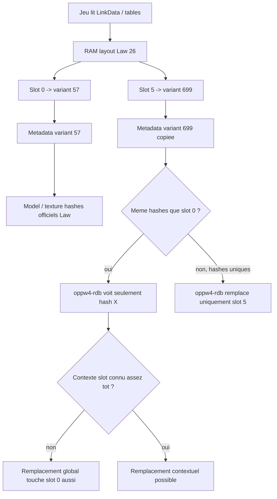

# Law Slot 5 - Clean Handoff 2026-05-16

Ce document resume l'etat reel de la recherche Law slot 5 pour repartir dans
un nouveau chat sans redecouvrir les memes pieges.

## Regles importantes

- Ne pas utiliser la compression LinkData. Mental note permanente : pas de
  compression.
- Utiliser `apps/dinput8-clean`, pas l'ancien `apps/dinput8-proxy`, pour les
  nouveaux tests DLL.
- Les nouveaux changements DLL vont dans `apps/dinput8-clean/src/changes/`.
- Split Rust obligatoire : pas de gros fichier monolithique.
- Ne pas restaurer les anciens hooks dangereux :
  - controller restore ;
  - controller+loader link restore ;
  - force visible ;
  - `child48` ;
  - mutation queue ;
  - mutation `1957` ;
  - mutation directe `mapped2d8=4713`.
- Ne pas utiliser l'ancien patch `.rdb.bin` en `original-offset`. Il tronque ou
  corrompt si le fichier custom est plus gros que l'original.

## Etat actuel du probleme

Le slot 5 peut apparaitre en RAM.

Ce qui reste bloque : obtenir un slot 5 qui charge un modele/textures propres
sans ecraser le slot 0 ou un autre slot officiel.

La preuve la plus recente :

- si le slot 5 pointe sur un modele officiel existant, le pipeline du jeu peut
  afficher quelque chose ;
- si on remplace les hashes globaux du modele officiel, le slot officiel qui
  utilise ces hashes est aussi touche ;
- donc le remplacement par hash seul ne sait pas naturellement "ce hash est pour
  slot 5".

Conclusion technique actuelle :

```text
Si slot 5 et slot 0 pointent vers le meme hash modele/texture,
oppw4-rdb ne peut pas savoir tout seul quel slot a demande ce hash.
```

Pour eviter les effets de bord, il faut soit :

- une vraie entree LinkData distincte avec des assets/hashes distincts ;
- soit un contexte runtime tres fiable avant le chargement des assets, ce qu'on
  n'a pas encore.

## Ce qui marche

### Slot 5 RAM

La duplication runtime du slot marche :

```text
layout=26
slot4=699
active_count=5
unlock slot4 force
UI slot bounds 4/5
```

Les patchs UI qui ont permis de voir 5 slots :

```text
game+0x155eca3 : 0x03 -> 0x04
game+0x1559c9f : 0x03 -> 0x04
game+0x1559d08 : 0x03 -> 0x04
game+0x1559d11 : 0x04 -> 0x05
```

Le hook unlock utile :

```text
game+0x12f52a0
```

Il force notamment Law slot 4 / variant 699 comme unlocked.

### Metadata runtime

On a valide que copier une metadata existante vers variant `699` fait entrer le
slot dans la logique costume.

Deux sources testees :

- `586` / Oni : affiche un skin si on accepte de pointer sur le modele Oni ;
- `57` / base Law slot 0 : direction correcte si on veut que le slot 5 parte
  du slot 0.

La lecon :

```text
Le slot 5 doit copier le slot 0 si le but est "slot 5 base Law modde".
Ne pas pointer sur Oni sauf test tres explicite.
```

### Assets custom disponibles

Le pack custom detecte contient :

```text
1 modele:
- MPLC026_Law.g1m

8 textures/materials:
- MPR_Bound_Character_MPLC026Law_cloth_kidsalb.g1t
- MPR_Bound_Character_MPLC026Law_cloth_kidsnmh.g1t
- MPR_Bound_Character_MPLC026Law_cloth_kidsocc.g1t
- MPR_Bound_Character_MPLC026Law_cloth_kidsrfr.g1t
- MPR_Bound_Character_MPLC026Law_skin_kidsalb.g1t
- MPR_Bound_Character_MPLC026Law_skin_kidsnmh.g1t
- MPR_Bound_Character_MPLC026Law_skin_kidsocc.g1t
- MPR_Bound_Character_MPLC026Law_skin_kidss4m.g1t
```

Hashes officiels notes dans `docs/reverse-notes/law-slot5-asset-package.md` :

```text
CharacterEditor:
- MPLC026_Law.g1m -> 0x8df2d8cb

MaterialEditor:
- cloth_kidsalb -> 0x966d6276
- cloth_kidsnmh -> 0x81b6a8a8
- cloth_kidsocc -> 0x38a6472e
- cloth_kidsrfr -> 0xd341d61d
- skin_kidsalb -> 0x8b5cca29
- skin_kidsnmh -> 0x2798f5b7
- skin_kidsocc -> 0x90986e71
- skin_kidss4m -> 0xbb2a9834
```

Ces hashes sont partages avec Law officiel, donc les remplacer globalement peut
toucher le slot 0/base.

## Ce qui ne marche pas ou ne doit plus etre refait

### Ancien patch `.rdb.bin` original-offset

Ne pas refaire :

```text
manager.patch_archive_original_read(...)
```

Probleme :

```text
custom plus gros que l'original => remplacement tronque dans la taille originale
=> modele/textures corrompus, ecran noir, preview vide, bugs de rendu.
```

### Fallback original global trop large

On a tente un passthrough original global pour les hashes Law.

Crash observe :

```text
Open virtual data/0x359b9672.file
file=800_294_face_law_dressrosa_External_00.g1t
source=ScreenLayout.rdb.bin@...
EXCEPTION_BREAKPOINT dans OPPW4.exe+0x3D89FC
```

Conclusion :

```text
Ne pas externaliser ScreenLayout/RRPreview globalement comme fallback original
sans preuve. Le jeu peut assert.
```

### Patch `mapped2d8=4713`

Mutation directe testee :

```text
mapped2d8 1957 -> 4713
```

Effet :

- result kind devenait comparable a Oni ;
- mais le nom UI du personnage disparaissait.

Conclusion :

```text
4713 est utile en read-only, pas en mutation directe.
```

### Controller restore

Tests faits :

- restore temporaire `state.controller` ;
- restore temporaire `controller+0x40 -> loader`.

Le test `controller+0x40` a crash :

```text
saved_controller_loader_current=0x4
```

Conclusion :

```text
Controller recycle/corrompu. Stop definitif de cette branche.
Ne pas restaurer d'autres champs controller a l'aveugle.
```

### Ressource 911 / 1957 / child8

Longue piste exploree :

- `911` cleanup dans `FUN_141582c30` ;
- reactivation `911` ;
- `child8` restore ;
- `1957` companion resource ;
- companion result ;
- render result.

Resultat :

```text
911 peut etre state=1 marker=0
1957 peut etre actif
child8 peut etre bon
companion result peut matcher Oni
mais preview peut rester invisible
```

Conclusion :

```text
Ce n'est pas le bon axe principal maintenant.
Le probleme actuel est l'identite asset/modele du slot 5, pas seulement 911.
```

## Diagramme du pipeline actuel



Conclusion du diagramme :

```text
Pour etre propre, slot 5 doit demander des hashes uniques.
Sinon on est condamne a du contexte fragile.
```

## Etat des crates / dossiers importants

### DLL propre

```text
apps/dinput8-clean
```

Nouveaux fichiers/mods a garder separes sous :

```text
apps/dinput8-clean/src/changes/
```

Modules deja crees :

```text
internal_hook.rs
law_slot5_assets.rs
law_slot5_model_mode.rs
law_slot5_runtime.rs
law_slot5_unlock.rs
linkdata_override.rs
```

### Data struct

```text
crates/data-struct
```

But : parser/decrire les entries LinkData proprement au lieu de travailler au
hasard.

### LinkData insert

```text
crates/linkdata-insert
```

But : generer/inserer les donnees LinkData proprement depuis les structures.

### RDB

```text
crates/oppw4-rdb
```

Ajout recent important :

```text
VirtualManager::patch_archive_read_if(...)
VirtualManager::patch_archive_index_external_flags_if(...)
```

But : permettre au hook DLL d'appliquer ou ignorer un remplacement selon une
condition, par exemple `slot5_active`.

## Etat recent du code avant nouveau chat

Attention : le code local peut etre dans un etat intermediaire parce que les
derniers tours ont ete interrompus.

Derniere intention correcte :

```text
slot 5 doit copier slot 0 / variant 57
pas Oni / variant 586
ne pas toucher slot 0 via remplacement global
```

Dernier changement demande :

```text
Dans oppw4-rdb, ajouter une condition "changes only if id == machin" :
le remplaceur global doit pouvoir ignorer les assets Law reserves hors contexte.
```

Ce qui a ete code juste avant le handoff :

```text
oppw4-rdb:
- patch_archive_read_if(...)
- patch_archive_index_external_flags_if(...)

dinput8-clean:
- allow_global_replacement(replacement)
- filtre les assets reserves Law/slot5 sauf si slot5_active=true
```

Mais le concept reste fragile car l'index RDB est souvent lu/cache avant que
`slot5_active=true` soit connu.

## LinkData : ce qu'on sait

### entry3

Entry3 contient une ligne Law qui matche la RAM officielle :

```text
offset=0x6d8
layout=26
variants=57,58,555,586,65535...
active_count=4
```

Patch minimal teste :

```text
slot4=699
active_count=5
```

On a eu des resultats variables selon les autres patches/hook actifs.

Erreur pas a refaire :

```text
Cloner une ligne entry3 large a casse les onglets :
Chopper deplace dans le mauvais tab.
```

Conclusion :

```text
Si entry3 est patch, patcher seulement les champs stricts, jamais cloner la ligne
complete.
```

### entry17

Entry17 contient des records/hits pour :

```text
699, 294, 911, 730, 1957, 4713
```

Hypothese :

```text
entry17 contient possiblement une liaison manquante entre costume/model/resource.
```

Besoin :

```text
Parser entry17 en vrais records, pas juste scanner les ids.
Comparer 57 / 586 / 699.
```

### entry29 / 32 / 35 / 39 / 52 / 58

Ces entries ont ete vues/remplies dans certains overrides, mais elles n'ont pas
suffi seules a produire un slot 5 propre et des assets corrects.

Important :

```text
292 n'est pas une bonne cible LinkData propre.
292 est occupe / alias / ancien probe runtime.
Ne pas le considerer comme cible finale.
```

`law-slot5-asset-package.md` indiquait :

```text
recommended_model_target=730
```

Mais attention : un id haut ou mal reference peut blackscreen si une condition
du jeu attend une plage plus basse ou une entree complete.

## Strategie recommandee pour le prochain chat

### Objectif propre

```text
slot 5 -> variant 699
variant 699 -> model id distinct
model id distinct -> asset names distincts
asset names distincts -> hashes distincts
oppw4-rdb remplace ces hashes sans contexte fragile
```

### Plan en 6 etapes

1. Repartir d'une DLL vraiment clean.
   - Pas de controller restore.
   - Pas de force visible.
   - Pas de `child48`.
   - Pas de mutation 1957.
   - Pas de mutation 4713.
   - Pas de patch `.rdb.bin original-offset`.

2. Verifier que le slot 5 RAM fonctionne sans asset custom.
   - Slot 5 visible.
   - Slot 0 normal.
   - Slot 5 clone slot 0.

3. Dumper la RAM d'un slot 0 fonctionnel et du slot 5 clone.
   - layout ;
   - variant metadata ;
   - model id ;
   - preview id ;
   - name/label ;
   - model/resource rows.

4. Retrouver les entries LinkData qui produisent ces champs.
   - entry3 pour layout ;
   - parser entry17 proprement ;
   - verifier entry29/32/35/39/52/58 ;
   - chercher autres entries qui referencent 57/586/699.

5. Creer un patch LinkData minimal.
   - Ne pas cloner de gros blocs aveuglement.
   - Patcher champ par champ.
   - Garder une table de correspondance source -> target.

6. Seulement apres : brancher des assets uniques.
   - nouveau nom modele ;
   - nouveaux noms textures ;
   - hashes uniques ;
   - remplacement `oppw4-rdb` normal sans contexte slot.

## Strategie alternative rapide mais sale

Si l'objectif est juste "le mod marche vite" :

```text
Accepter de remplacer globalement le modele/textures du slot source.
```

Avantage :

- beaucoup plus simple ;
- le jeu sait deja charger le modele/textures.

Inconvenient :

- le slot officiel source est aussi modifie.

Cette strategie a ete rejetee pour le moment car elle touche le slot 0 / un slot
officiel.

## Ce qu'il faut verifier au debut du nouveau chat

1. Etat Git :

```text
git status --short
```

2. Etat DLL installee :

```text
D:/SteamLibrary/steamapps/common/OPPW4/dinput8.dll
```

3. Chercher si un vieux patch global est encore actif :

```text
rg "LAW_SLOT5_BIN_READ_PATCH_ENABLED|source308-proof|copy-source-slot0|patch_archive_original_read|allow_global_replacement" apps/dinput8-clean/src crates/oppw4-rdb/src
```

4. Confirmer que le nouveau chat comprend :

```text
Le slot 5 doit pointer sur slot 0/base Law pour le test de base.
Il ne doit pas pointer sur Oni sauf test explicite.
```

## Logs recents utiles

Logs mentionnes autour du dernier etat :

```text
2026-05-16_11-30-35.log
2026-05-16_11-33-53.log
2026-05-16_11-48-16.log
2026-05-16_11-54-34.log
2026-05-16_12-15-37.log
2026-05-16_12-19-08.log
```

Log crash important :

```text
D:/SteamLibrary/steamapps/common/OPPW4/logs/crash.log
```

Crash `2026-05-16_12-15-37` :

```text
EXCEPTION_BREAKPOINT
OPPW4.exe+0x3D89FC
apres Open virtual data/0x359b9672.file
ScreenLayout passthrough original
```

Conclusion du crash :

```text
Ne pas externaliser ScreenLayout globalement en fallback original.
```

## Question ouverte principale

La question a resoudre proprement :

```text
Quelles entries LinkData exactes font que variant 699 demande ses propres
assets/hashes au lieu de reutiliser les hashes du slot 0 ?
```

Tant que cette question n'est pas resolue, le remplacement par hash risque de
toucher un slot officiel.

## Recommandation finale

Le prochain chat doit eviter de refaire du live-patch au hasard.

Demarrage recommande :

```text
1. Lire ce fichier.
2. Lire docs/reverse-notes/law-slot5-asset-package.md.
3. Lire seulement les sections recentes de current-handoff.md si besoin.
4. Stabiliser dinput8-clean.
5. Faire un dump LinkData/RAM cible.
6. Patcher LinkData champ par champ.
```

But final :

```text
Un slot 5 Law variant 699 propre,
avec nom/preview/model/textures distincts,
sans ecraser slot 0 ni Oni.
```

## Update 2026-05-16 15:42 - pause jeu, ne pas installer

Etat au moment de la pause :

```text
Ne pas installer de nouvelle DLL pendant la pause.
Le joueur veut garder la DLL actuelle et jouer.
DLL installee: D:/SteamLibrary/steamapps/common/OPPW4/dinput8.dll
SHA256 installe = 0B152084CF477DCB736EF80AD2606D09AA9DDEB40B74100A65765B42D7EB8496
Build local target/debug/dinput8.dll = meme SHA256
Dernier log analyse: D:/SteamLibrary/steamapps/common/OPPW4/mods/_oppw4/logs/2026-05-16_15-42-23.log
```

Diagnostic file-job :

```text
file-job-diagnostic hooks installed=true
hook interne actif: game+0xa76830
HASH FILE OPEN callers:
  game+0xa769cf -> game+0xa78d8b -> game+0xa78bae -> game+0x1147535
HASH FILE READ callers:
  game+0xa773ad -> game+0xa7919d/0xa79224 -> game+0xa78bae -> game+0x1147535
```

Conclusion importante :

```text
path_owner n'est PAS le bon objet par fichier:
  path_owner reste stable
  wide_candidates ne donne que "D:"
  path_owner_dump contient essentiellement "D:" + zeros

file_state EST le bon objet par fichier:
  file_state change pour chaque hash
  file_state_dump contient le chemin complet UTF-16:
    /SteamLibrary/steamapps/common/OPPW4/File/CMN/AssetRelease/Retail/data/0xHASH.file
```

Offsets observes dans `file_state_dump` :

```text
file_state + 0x00: ff ff ff ff ff ff ff ff
file_state + 0x08: ff ff ff ff ff ff ff ff
file_state + 0x18: d0 07 00 02
file_state + 0x20: 01 00 00 00
file_state + 0x28: 01 00 00 00
file_state + 0x30: ff ff ff ff ff ff ff ff
file_state + 0x38: debut chemin UTF-16 avec slash avant SteamLibrary
```

Exemples utiles :

```text
0xb4744124.file:
  job=0x1bd8e0059c0
  file_state=0x1bd8dff8e50
  prev_file_state=0x1bd8dff8558
  file_state_dump contient .../data/0xb4744124.file

0xd1566b4d.file:
  job=0x1bd8e0059c0
  file_state=0x1bd8dffd610
  prev_file_state=0x1bd8dffcd18
  file_state_dump contient .../data/0xd1566b4d.file
```

Etat Law slot 5 dans ce log :

```text
law-slot5-layout-patch layout=26 slot=4 before=699 after=699 count_before=5 count_after=5
law-slot5-metadata-patch source_variant=57 target_variant=699 before_model=65535 after_model=730 after_preview=294 model_mode=private-model730-manager-alias
law-slot5-runtime-ready variant=699 source_variant=57 source_slot=0 model_mode=private-model730-manager-alias

resource 26:
  charge correctement
  source(ptr=0x1bd912832c0,state=1)

resource 730:
  demande can-start-load/enqueue-load
  reste vide:
    target(ptr=0x0,state=0)
    loaded-check result=0
```

Prochaine action recommandee apres la pause :

```text
Ne pas reinstaller une DLL tout de suite.
Analyser Ghidra autour de la construction du file_state / job avant game+0xa76830.
Objectif: trouver qui remplit file_state + 0x38 avec data/0xHASH.file,
et remonter a la source nom/hash/RDB.

Cible technique probable:
  la fonction qui cree/enqueue le job I/O avec path complet avant le worker.
  Le worker ne choisit pas le hash; il consomme deja un file_state pret.
```
